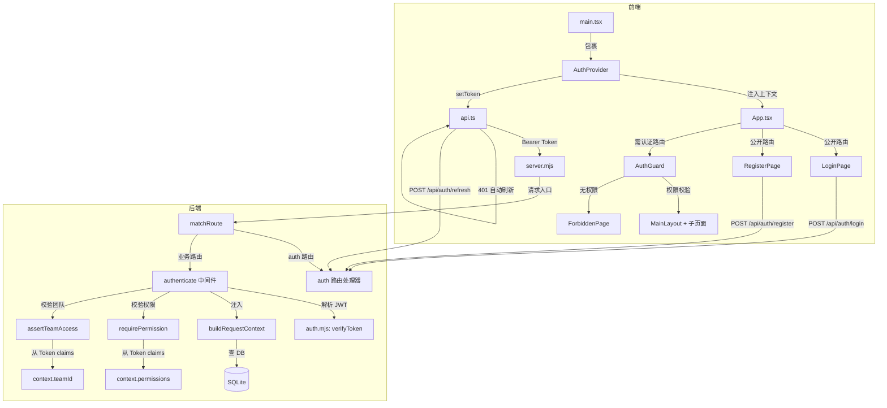
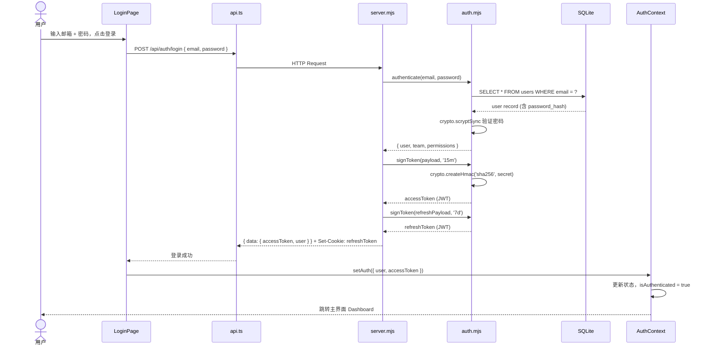
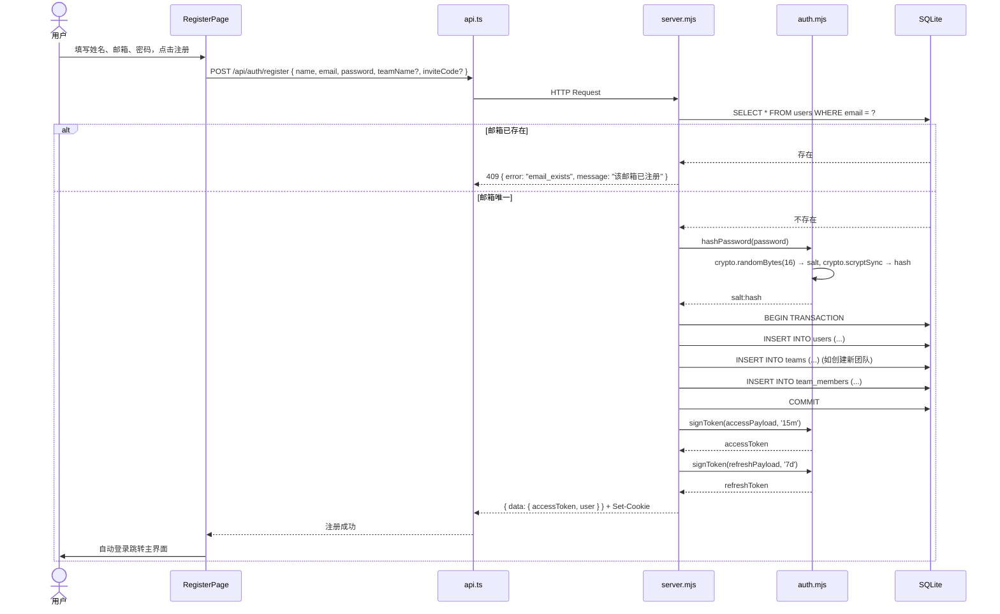
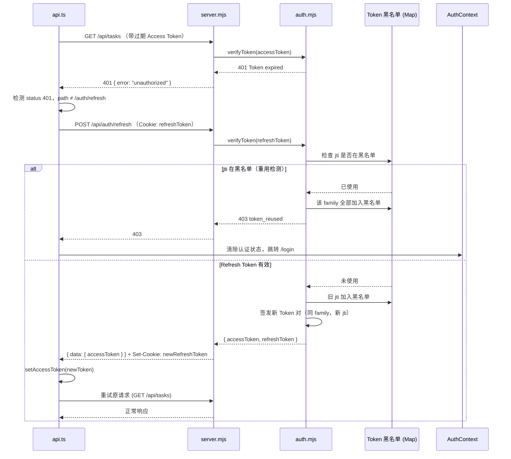
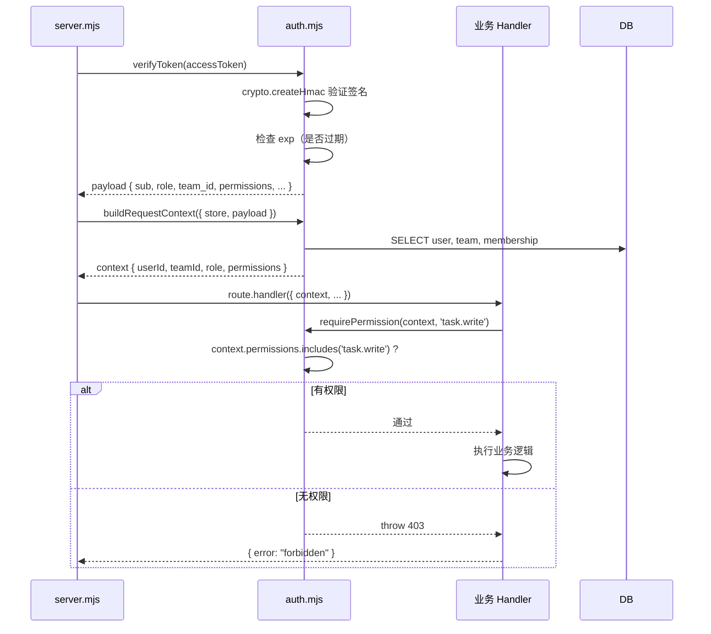

# Vocos 登录认证与权限管理 — 架构设计

> **版本**：v1.0  
> **作者**：高见远（架构师）  
> **日期**：2026-06-06  
> **状态**：设计完成  
> **依赖**：`docs/PRD-AUTH.md` v1.0  
> **核心约束**：零外部 npm 依赖，Node.js 内置模块优先

---

## 目录

1. [模块关系图](#1-模块关系图)
2. [数据流图](#2-数据流图)
3. [新增/修改文件清单](#3-新增修改文件清单)
4. [JWT 实现方案](#4-jwt-实现方案)
5. [密码哈希方案](#5-密码哈希方案)
6. [AuthContext 接口设计](#6-authcontext-接口设计)
7. [API 响应格式规范](#7-api-响应格式规范)
8. [后端 auth.mjs 模块设计](#8-后端-authmjs-模块设计)
9. [安全策略落实](#9-安全策略落实)

---

## 1. 模块关系图



### 关键关系说明

| 模块 | 职责 | 对外暴露 |
|------|------|---------|
| **auth.mjs** | JWT 签发/验证、密码哈希、权限校验、团队隔离 | `signToken`, `verifyToken`, `hashPassword`, `verifyPassword`, `buildRequestContext`, `requirePermission`, `assertTeamAccess`, `filterByTeam`, `PERMISSIONS`, `ROLE_PERMISSIONS` |
| **server.mjs** | HTTP 路由注册、auth endpoint 处理器、CORS/安全头 | `createApiServer` |
| **AuthContext.tsx** | React 认证状态管理、登录/注册/登出方法 | `AuthProvider`, `useAuth` |
| **AuthGuard.tsx** | 路由守卫：认证 + 权限 | `<AuthGuard requiredPermissions={[...]}>` |
| **LoginPage.tsx** | 登录表单 UI | 路由 `/login` |
| **RegisterPage.tsx** | 注册表单 UI | 路由 `/register` |
| **api.ts** | HTTP 客户端：Token 注入 + 401 自动刷新 | `api`, `setAccessToken` |

---

## 2. 数据流图

### 2.1 登录流程



### 2.2 注册流程



### 2.3 Token 刷新流程



### 2.4 权限校验流程（API 层面）



---

## 3. 新增/修改文件清单

### 3.1 新增文件

| # | 文件路径 | 类型 | 说明 |
|---|---------|------|------|
| 1 | `docs/ARCH-AUTH.md` | 新增 | 本文档，架构设计说明书 |
| 2 | `docs/TASKS-AUTH.md` | 新增 | 实现任务分解列表 |
| 3 | `frontend/src/shared/auth/AuthContext.tsx` | 新增 | 认证上下文 Provider + useAuth Hook |
| 4 | `frontend/src/shared/auth/AuthGuard.tsx` | 新增 | 路由守卫组件（认证 + 权限） |
| 5 | `frontend/src/features/auth/LoginPage.tsx` | 新增 | 登录表单页 |
| 6 | `frontend/src/features/auth/RegisterPage.tsx` | 新增 | 注册表单页 |
| 7 | `frontend/src/features/auth/ForbiddenPage.tsx` | 新增 | 403 无权限页面 |
| 8 | `frontend/src/features/auth/SettingsPage.tsx` | 新增 | 用户设置页（P1） |

### 3.2 修改文件

| # | 文件路径 | 改动类型 | 说明 |
|---|---------|---------|------|
| 1 | `backend/src/auth.mjs` | **重写** | 从 56 行桩代码扩展为完整认证模块，包含 JWT、密码哈希、权限校验、团队隔离 |
| 2 | `backend/src/server.mjs` | **修改** | 添加 8 个 auth API 路由 + 4 个团队管理路由、修改 `send()` CORS 配置、wrapper 中间件接入 |
| 3 | `frontend/src/App.tsx` | **修改** | 路由拆分（公开/认证）、包裹 AuthProvider + AuthGuard、侧边栏菜单根据权限动态渲染 |
| 4 | `frontend/src/shared/services/api.ts` | **修改** | 添加 `Authorization` Header 注入、401 自动刷新 Token、`setAccessToken` 导出、`credentials: 'include'` |
| 5 | `frontend/src/main.tsx` | **修改** | 在 App 外层包裹 AuthProvider |
| 6 | `backend/db/seed.sql` | **修改** | 为 3 个 demo 用户添加 password_hash（demo123456） |

### 3.3 不改动的文件

| 文件 | 原因 |
|------|------|
| `backend/db/schema.sql` | users/teams/team_members 表结构已完备，无需变更 |
| 所有 `features/*/` 下的业务页面 | 鉴权由 AuthGuard 统一处理，页面内部不改动 |
| `backend/src/store.mjs` | SQLite 数据层保持不变 |
| `package.json` / `package-lock.json` | 严格遵守零外部依赖约束 |

---

## 4. JWT 实现方案

### 4.1 设计原则

- **零依赖**：使用 Node.js 内置 `crypto` 模块实现，不引入 `jsonwebtoken` 或任何第三方 JWT 库
- **算法**：HMAC-SHA256（HS256），对称密钥
- **密钥**：环境变量 `JWT_SECRET`（≥32 字符），开发环境默认 `vocos-dev-secret-change-in-production`

### 4.2 核心函数签名

```javascript
// auth.mjs 中新增的函数

/**
 * 签发 JWT Token
 * @param {Object} payload - 自定义 claims（不含 iat/exp/jti，自动注入）
 * @param {string} expiresIn - 有效期，如 '15m' / '7d'
 * @returns {string} 完整的 JWT 字符串
 */
function signToken(payload, expiresIn)

/**
 * 验证并解析 JWT Token
 * @param {string} token - JWT 字符串
 * @returns {{ payload: Object, jti: string }} 解析后的 payload（验证失败时 throw）
 * @throws {Error} invalid_token | token_expired
 */
function verifyToken(token)
```

### 4.3 实现方式

```
JWT 结构: base64url(header) . base64url(payload) . base64url(signature)

签名算法:
  HMAC-SHA256(base64url(header) + "." + base64url(payload), JWT_SECRET)

具体步骤:
  1. header = { "alg": "HS256", "typ": "JWT" }
  2. payload = { ...claims, iat: now, exp: now + expiresIn, jti: crypto.randomUUID() }
  3. unsignedToken = base64url(header) + "." + base64url(payload)
  4. signature = crypto.createHmac("sha256", JWT_SECRET).update(unsignedToken).digest("base64url")
  5. return unsignedToken + "." + signature

验证步骤:
  1. 按 "." 分割 token，得到三部分
  2. 重新计算签名，与第三部分比对（恒定时间比较 crypto.timingSafeEqual）
  3. 解码 payload，检查 exp > now
  4. 返回 payload
```

### 4.4 base64url 实现

```javascript
// Node.js 内置 Buffer 即可实现，无需外部库
function base64urlEncode(str) {
  return Buffer.from(str).toString("base64url");
}

function base64urlDecode(str) {
  return Buffer.from(str, "base64url").toString("utf8");
}
```

### 4.5 Access Token Payload 结构

```javascript
{
  sub: "user_demo",              // 用户 ID
  email: "admin@vocos.local",    // 邮箱
  name: "Demo Admin",            // 姓名
  role: "super_admin",           // 角色
  team_id: "team_demo",          // 默认团队 ID
  team_name: "Vocos Demo Team",  // 团队名称（展示用）
  permissions: [                 // 权限列表
    "task.read", "task.write",
    "ai_run.read", "ai_run.write",
    // ...
  ],
  iat: 1717603200,               // 签发时间
  exp: 1717604100,               // 过期时间 (iat + 900s)
  jti: "<uuid>"                  // Token 唯一 ID
}
```

### 4.6 Refresh Token Payload 结构

```javascript
{
  sub: "user_demo",              // 用户 ID
  jti: "<uuid>",                 // Token 唯一 ID
  family: "<uuid>",              // Token 族 ID（每次刷新不变）
  iat: 1717603200,               // 签发时间
  exp: 1718208000                // 过期时间 (iat + 604800s = 7d)
}
```

### 4.7 Token 生命周期（Refresh Token 旋转）

```javascript
// 内存中维护的黑名单（重启后清空，符合 PRD Q3 选项 A）
const tokenBlacklist = new Map();  // Map<jti, { family, expiresAt }>

// 刷新流程：
// 1. verifyToken(refreshToken) → 获取 payload
// 2. 检查 payload.jti 是否在黑名单中
//    - 是 → 该 family 全部 token 加入黑名单 → 返回 403 token_reused
//    - 否 → 继续
// 3. 旧 jti 加入黑名单（expiresAt = payload.exp）
// 4. 签发新 Access Token + 新 Refresh Token（同 family，新 jti）
// 5. 返回新的 Token 对
```

---

## 5. 密码哈希方案

### 5.1 设计原则

- **零依赖**：使用 Node.js 内置 `crypto` 模块的 `scryptSync`，不引入 `bcryptjs` 或 `bcrypt`
- **算法**：scrypt（内存硬性 KDF，抗 GPU/ASIC 暴力破解）
- **存储格式**：`salt:hash`（十六进制拼接，冒号分隔）

### 5.2 核心函数签名

```javascript
/**
 * 密码哈希（注册 / 修改密码时调用）
 * @param {string} password - 明文密码
 * @returns {string} "salt_hex:hash_hex" 格式的哈希值
 */
function hashPassword(password)

/**
 * 密码验证（登录 / 修改密码时调用）
 * @param {string} password - 明文密码
 * @param {string} stored - 存储的 "salt:hash" 字符串
 * @returns {boolean} 密码是否匹配
 */
function verifyPassword(password, stored)
```

### 5.3 实现方式

```javascript
import crypto from "node:crypto";

const SCRYPT_KEYLEN = 64;    // 输出 64 字节
const SCRYPT_N = 16384;      // CPU/内存成本参数 (2^14)
const SCRYPT_R = 8;          // 块大小
const SCRYPT_P = 1;          // 并行度

function hashPassword(password) {
  const salt = crypto.randomBytes(16);
  const hash = crypto.scryptSync(password, salt, SCRYPT_KEYLEN, {
    N: SCRYPT_N, r: SCRYPT_R, p: SCRYPT_P
  });
  return `${salt.toString("hex")}:${hash.toString("hex")}`;
}

function verifyPassword(password, stored) {
  const [saltHex, hashHex] = stored.split(":");
  const salt = Buffer.from(saltHex, "hex");
  const expectedHash = Buffer.from(hashHex, "hex");
  const actualHash = crypto.scryptSync(password, salt, SCRYPT_KEYLEN, {
    N: SCRYPT_N, r: SCRYPT_R, p: SCRYPT_P
  });
  // 恒定时间比较，防止时序攻击
  return crypto.timingSafeEqual(actualHash, expectedHash);
}
```

### 5.4 scrypt 参数说明

| 参数 | 值 | 说明 |
|------|----|------|
| `N` | 16384 (2^14) | CPU/内存成本因子，越大越安全但越慢 |
| `r` | 8 | 块大小参数 |
| `p` | 1 | 并行度参数 |
| `keylen` | 64 | 输出哈希长度（字节） |
| `salt` | 16 字节随机 | 每个密码独立加盐 |

> **注意**：`scryptSync` 是同步版本，因为 `auth.mjs` 中所有用法都在 async handler 的同步路径中（verifyToken 之后），暂时够用。若后续有性能瓶颈，可升级为 `scrypt` 异步版本。

### 5.5 种子数据密码

所有 Demo 用户统一密码：`demo123456`

种子数据中写入预计算的 scrypt 哈希（salt + hash 固定值，由 hashPassword('demo123456') 生成后硬编码到 seed.sql）。

---

## 6. AuthContext 接口设计

### 6.1 TypeScript 类型定义

```typescript
// ============================================================
// 用户与团队类型
// ============================================================

interface User {
  id: string;
  name: string;
  email: string;
  phone?: string | null;
  avatarUrl?: string | null;
  role: UserRole;
  status: string;
  createdAt: string;
}

interface Team {
  id: string;
  teamName: string;
  planType: string;
  status: string;
  createdAt: string;
}

type UserRole = "super_admin" | "team_admin" | "ai_engineer_admin" | "member";

// ============================================================
// AuthState — 认证状态
// ============================================================

interface AuthState {
  /** 当前用户信息（null = 未登录） */
  user: User | null;

  /** 当前团队信息 */
  team: Team | null;

  /** 权限列表（字符串数组，来自 JWT payload.permissions） */
  permissions: string[];

  /** Access Token（仅存内存，不持久化） */
  accessToken: string | null;

  /** 是否已完成认证（user !== null && accessToken !== null） */
  isAuthenticated: boolean;

  /** 初始加载中（挂载时检查 Refresh Token） */
  isLoading: boolean;

  /** 最近一次认证错误信息（用于显示） */
  error: string | null;
}

// ============================================================
// AuthContextValue — 对外暴露的 Context 值
// ============================================================

interface AuthContextValue {
  // --- 状态 ---
  user: User | null;
  team: Team | null;
  permissions: string[];
  isAuthenticated: boolean;
  isLoading: boolean;
  error: string | null;

  // --- 操作方法 ---
  /** 登录：调用 POST /api/auth/login */
  login: (email: string, password: string) => Promise<void>;

  /** 注册：调用 POST /api/auth/register */
  register: (data: RegisterInput) => Promise<void>;

  /** 登出：调用 POST /api/auth/logout，清除状态 */
  logout: () => Promise<void>;

  /** 刷新 Token：调用 POST /api/auth/refresh */
  refreshToken: () => Promise<string | null>;

  /** 更新用户资料（本地状态 + 服务端） */
  updateProfile: (data: UpdateProfileInput) => Promise<void>;

  /** 修改密码 */
  changePassword: (oldPassword: string, newPassword: string) => Promise<void>;

  /** 检查是否拥有指定权限 */
  hasPermission: (permission: string) => boolean;

  /** 检查是否拥有全部指定权限 */
  hasAllPermissions: (permissions: string[]) => boolean;
}

// ============================================================
// 表单输入类型
// ============================================================

interface RegisterInput {
  name: string;
  email: string;
  password: string;
  teamName?: string;
  inviteCode?: string;
}

interface UpdateProfileInput {
  name?: string;
  phone?: string;
  avatarUrl?: string;
}

// ============================================================
// AuthProvider Props
// ============================================================

interface AuthProviderProps {
  children: React.ReactNode;
}
```

### 6.2 AuthContext 实现要点

```typescript
// AuthContext.tsx 核心逻辑伪代码

export function AuthProvider({ children }: AuthProviderProps) {
  const [state, dispatch] = useReducer(authReducer, initialState);
  // initialState: { user: null, team: null, permissions: [],
  //                 accessToken: null, isAuthenticated: false,
  //                 isLoading: true, error: null }

  // 1. 挂载时初始化
  useEffect(() => {
    initializeAuth();
  }, []);

  async function initializeAuth() {
    try {
      // 尝试用 Cookie 中的 Refresh Token 获取 Access Token
      const res = await fetch(`${API_BASE}/auth/refresh`, {
        method: "POST",
        credentials: "include",
        headers: { "Content-Type": "application/json" }
      });
      if (!res.ok) {
        // 无有效 Refresh Token，保持未登录状态
        dispatch({ type: "SET_LOADING", isLoading: false });
        return;
      }
      const { data } = await res.json();
      setAccessToken(data.accessToken);  // 注入到 api.ts
      // 获取用户完整信息
      const meRes = await fetch(`${API_BASE}/auth/me`, {
        headers: { "Authorization": `Bearer ${data.accessToken}` }
      });
      const meData = await meRes.json();
      dispatch({ type: "LOGIN_SUCCESS", payload: meData.data });
    } catch {
      dispatch({ type: "SET_LOADING", isLoading: false });
    }
  }

  async function login(email: string, password: string) {
    dispatch({ type: "AUTH_START" });
    try {
      const res = await fetch(`${API_BASE}/auth/login`, {
        method: "POST",
        credentials: "include",
        headers: { "Content-Type": "application/json" },
        body: JSON.stringify({ email, password })
      });
      if (!res.ok) {
        const err = await res.json();
        throw new Error(err.message || "登录失败");
      }
      const { data } = await res.json();
      setAccessToken(data.accessToken);
      dispatch({ type: "LOGIN_SUCCESS", payload: data });
    } catch (error) {
      dispatch({ type: "AUTH_ERROR", error: error.message });
      throw error;
    }
  }

  // register, logout, refreshToken 类似...

  function hasPermission(permission: string): boolean {
    return state.permissions.includes(permission);
  }

  function hasAllPermissions(permissions: string[]): boolean {
    return permissions.every(p => state.permissions.includes(p));
  }

  // 注意：无需设置 withCredentials，fetch 的 credentials: 'include' 已在 api.ts 中配置

  return (
    <AuthContext.Provider value={{ ...state, login, register, logout,
      refreshToken, updateProfile, changePassword,
      hasPermission, hasAllPermissions }}>
      {children}
    </AuthContext.Provider>
  );
}

export function useAuth(): AuthContextValue {
  const context = useContext(AuthContext);
  if (!context) {
    throw new Error("useAuth must be used within AuthProvider");
  }
  return context;
}
```

### 6.3 AuthGuard 组件

```typescript
// AuthGuard.tsx

interface AuthGuardProps {
  children: React.ReactNode;
  /** 所需权限列表（空数组 = 仅需登录） */
  requiredPermissions?: string[];
}

function AuthGuard({ children, requiredPermissions = [] }: AuthGuardProps) {
  const { isAuthenticated, isLoading, hasAllPermissions } = useAuth();

  if (isLoading) {
    return <FullScreenLoader />;  // 全屏 Loading 组件
  }

  if (!isAuthenticated) {
    return <Navigate to="/login" replace />;
  }

  if (requiredPermissions.length > 0 && !hasAllPermissions(requiredPermissions)) {
    return <Navigate to="/403" replace />;
  }

  return <>{children}</>;
}
```

### 6.4 useAuth 使用示例

```typescript
// 在页面组件中使用
function StrategyPage() {
  const { hasPermission } = useAuth();
  const canWriteSchema = hasPermission("schema.write");

  return (
    <div>
      <h1>策略 & Agent</h1>
      {canWriteSchema && <button>新建 Schema</button>}
    </div>
  );
}
```

---

## 7. API 响应格式规范

### 7.1 统一响应格式

所有 API 响应遵循统一格式：

**成功响应**：
```json
{
  "data": { /* 业务数据 */ },
  "meta": { /* 可选元数据（分页信息等） */ }
}
```

**错误响应**：
```json
{
  "error": "<error_code>",
  "message": "<人类可读错误描述>"
}
```

### 7.2 错误码表

| HTTP 状态码 | error 字段 | message 示例 | 说明 |
|------------|-----------|-------------|------|
| 400 | `bad_request` | "Missing required fields: email, password" | 参数校验失败 |
| 401 | `unauthorized` | "Token has expired" | Token 无效或过期 |
| 401 | `invalid_credentials` | "邮箱或密码错误" | 登录凭据错误 |
| 401 | `no_token` | "Authorization header is missing" | 未提供 Token |
| 403 | `forbidden` | "Insufficient permissions" | 权限不足 |
| 403 | `not_team_member` | "You are not a member of this team" | 非团队成员 |
| 403 | `token_reused` | "Refresh token reuse detected" | Refresh Token 重用 |
| 404 | `not_found` | "User not found" | 资源不存在 |
| 409 | `email_exists` | "该邮箱已注册" | 邮箱冲突 |
| 429 | `too_many_attempts` | "Too many login attempts, try again in 15 minutes" | 登录限流 |
| 500 | `internal_error` | "An unexpected error occurred" | 服务端内部错误 |

### 7.3 Auth API 响应示例

**POST /api/auth/login — 成功**：
```json
{
  "data": {
    "accessToken": "eyJhbGciOiJIUzI1NiIs...",
    "user": {
      "id": "user_demo",
      "name": "Demo Admin",
      "email": "admin@vocos.local",
      "role": "super_admin",
      "avatarUrl": null
    },
    "team": {
      "id": "team_demo",
      "teamName": "Vocos Demo Team"
    },
    "permissions": ["task.read", "task.write", "..."]
  }
}
```
+ `Set-Cookie: refreshToken=<jwt>; HttpOnly; Secure; SameSite=Strict; Path=/api/auth; Max-Age=604800`

**POST /api/auth/login — 失败**：
```json
{
  "error": "invalid_credentials",
  "message": "邮箱或密码错误"
}
```

**GET /api/auth/me — 成功**：
```json
{
  "data": {
    "user": {
      "id": "user_demo",
      "name": "Demo Admin",
      "email": "admin@vocos.local",
      "role": "super_admin",
      "phone": null,
      "avatarUrl": null,
      "status": "active",
      "createdAt": "2026-01-01T00:00:00.000Z"
    },
    "team": {
      "id": "team_demo",
      "teamName": "Vocos Demo Team",
      "planType": "internal"
    },
    "permissions": ["task.read", "task.write", "..."]
  }
}
```

### 7.4 响应格式与现有代码兼容

现有业务 API 响应格式已是 `{ data: ... }` 包裹，与 auth API 格式一致。现有 `server.mjs` 中：
- 成功响应：`{ data: result }` 或 `{ data: result, meta: {...} }`
- 错误响应：`{ error: code, message: desc }`

**无需改动**现有响应格式，auth API 遵循相同规范即可。

---

## 8. 后端 auth.mjs 模块设计

### 8.1 模块结构

```
auth.mjs (重写后约 300 行)
├── 常量定义
│   ├── JWT_SECRET (process.env.VOCOS_JWT_SECRET || 默认值)
│   ├── PERMISSIONS (17 项权限枚举)
│   └── ROLE_PERMISSIONS (角色 → 权限映射表)
│
├── JWT 工具函数
│   ├── base64urlEncode / base64urlDecode
│   ├── signToken(payload, expiresIn) → string
│   └── verifyToken(token) → { payload, jti }
│
├── 密码工具函数
│   ├── hashPassword(password) → "salt:hash"
│   └── verifyPassword(password, stored) → boolean
│
├── Token 黑名单
│   ├── tokenBlacklist (Memory Map)
│   ├── addToBlacklist(jti, family, expiresAt)
│   ├── isBlacklisted(jti) → boolean
│   └── revokeFamily(family)
│
├── 认证中间件
│   ├── authenticate(store, headers) → context
│   └── buildRequestContext({ store, payload }) → context
│
├── 权限与团队校验（改造桩函数为真实实现）
│   ├── requirePermission(context, permission) → void | throw
│   ├── assertTeamAccess(context, teamId) → void | throw
│   └── filterByTeam(context, records) → filtered records
│
└── 导出
    └── export { PERMISSIONS, hashPassword, verifyPassword,
                signToken, verifyToken, authenticate,
                buildRequestContext, requirePermission,
                assertTeamAccess, filterByTeam,
                addToBlacklist, isBlacklisted, revokeFamily }
```

### 8.2 角色-权限映射表

```javascript
const ROLE_PERMISSIONS = {
  super_admin: [
    "task.read", "task.write",
    "ai_run.read", "ai_run.write",
    "report.read", "report.write",
    "cost.read", "quality.read", "audit.read",
    "schema.read", "schema.write",
    "prompt.read", "prompt.write",
    "model.read", "model.write",
    "team.manage", "user.manage"
  ],
  team_admin: [
    "task.read", "task.write",
    "ai_run.read", "ai_run.write",
    "report.read", "report.write",
    "cost.read", "quality.read", "audit.read",
    "schema.read", "prompt.read", "model.read",
    "team.manage"
  ],
  ai_engineer_admin: [
    "task.read",
    "ai_run.read", "ai_run.write",
    "report.read",
    "quality.read",
    "schema.read", "schema.write",
    "prompt.read", "prompt.write",
    "model.read", "model.write"
  ],
  member: [
    "task.read",
    "ai_run.read",
    "report.read"
  ]
};
```

### 8.3 buildRequestContext 改造

```javascript
// 旧逻辑：从 Header x-user-id / x-team-id 读取
// 新逻辑：从 JWT payload 解析

export function buildRequestContext({ store, headers = {} }) {
  // 1. 从 Authorization Header 提取 Bearer Token
  const authHeader = headers["authorization"] ?? "";
  const tokenMatch = authHeader.match(/^Bearer\s+(.+)$/i);
  const token = tokenMatch?.[1] ?? null;

  if (!token) {
    // 开发环境降级：x-user-id Header
    if (process.env.NODE_ENV === "development") {
      return buildDevContext({ store, headers });
    }
    throw authError("no_token", "Authorization header is missing");
  }

  // 2. 验证 JWT
  const { payload } = verifyToken(token);

  // 3. 从 DB 查询用户/团队/成员关系（验证数据完整性）
  const user = store.list?.("users")?.find(u => u.id === payload.sub) ?? null;
  const team = store.list?.("teams")?.find(t => t.id === payload.team_id) ?? null;

  if (!user || user.status !== "active") {
    throw authError("unauthorized", "User is not active");
  }

  // 4. 返回 context
  return {
    userId: payload.sub,
    userName: payload.name,
    teamId: payload.team_id,
    teamName: payload.team_name,
    role: payload.role,
    permissions: payload.permissions,
    user,
    team
  };
}

// 开发环境降级（保留向后兼容）
function buildDevContext({ store, headers }) {
  const userId = headers["x-user-id"] || "user_demo";
  const teamId = headers["x-team-id"] || "team_demo";
  const user = store.list?.("users")?.find(u => u.id === userId) ?? null;
  const team = store.list?.("teams")?.find(t => t.id === teamId) ?? null;
  const membership = store.list?.("teamMembers")?.find(
    m => m.userId === userId && m.teamId === teamId
  ) ?? null;
  return {
    userId,
    userName: user?.name ?? "Demo User",
    teamId,
    teamName: team?.name ?? "Demo Team",
    role: membership?.role ?? "super_admin",
    permissions: ROLE_PERMISSIONS[membership?.role] ?? ROLE_PERMISSIONS.super_admin,
    user,
    team
  };
}
```

### 8.4 权限校验函数改造

```javascript
// requirePermission — 从空函数改为真实校验
export function requirePermission(context, permission) {
  if (!context.permissions || !Array.isArray(context.permissions)) {
    throw forbiddenError("No permissions found in context");
  }
  if (!context.permissions.includes(permission)) {
    throw forbiddenError(`Missing permission: ${permission}`);
  }
}

// assertTeamAccess — 从空函数改为真实校验
export function assertTeamAccess(context, resourceTeamId) {
  // super_admin 允许访问所有团队
  if (context.role === "super_admin") return;
  if (!resourceTeamId) return;
  if (context.teamId !== resourceTeamId) {
    throw forbiddenError("You do not have access to this team's resources");
  }
}

// filterByTeam — 从返回全部改为按团队过滤
export function filterByTeam(context, records) {
  // super_admin 看到全部
  if (context.role === "super_admin") return records;
  return records.filter(r => r.teamId === context.teamId);
}

// 辅助：创建 403 错误
function forbiddenError(message) {
  const err = new Error(message);
  err.statusCode = 403;
  err.code = "forbidden";
  return err;
}

// 辅助：创建 401 错误
function authError(code, message) {
  const err = new Error(message);
  err.statusCode = 401;
  err.code = code;
  return err;
}
```

### 8.5 server.mjs 路由变更

```javascript
// matchRoute 新增的 auth 路由（8 个）
["POST", /^\/api\/auth\/login$/, handleLogin],
["POST", /^\/api\/auth\/register$/, handleRegister, 201],
["POST", /^\/api\/auth\/logout$/, handleLogout],
["POST", /^\/api\/auth\/refresh$/, handleRefreshToken],
["GET",  /^\/api\/auth\/me$/, handleGetMe],
["PUT",  /^\/api\/auth\/me$/, handleUpdateMe],
["PUT",  /^\/api\/auth\/me\/password$/, handleChangePassword],

// 修改现有路由
["GET",  /^\/api\/auth\/context$/, getAuthContext],  // 已有，需适配
```

注意路由注册顺序：`/api/auth/me/password` 必须在 `/api/auth/me` 之前，否则后者的通配匹配会先捕获。

### 8.6 CORS 改造

```javascript
// send() 函数修改

// 旧：
// "access-control-allow-origin": "*"
// "access-control-allow-headers": "content-type,x-user-id,x-team-id"

// 新：
const ALLOWED_ORIGINS = process.env.NODE_ENV === "production"
  ? ["https://vocosai.com"]
  : ["http://localhost:5173", "http://127.0.0.1:3000", "http://localhost:3000"];

const origin = request.headers["origin"] ?? "";
const allowOrigin = ALLOWED_ORIGINS.includes(origin) ? origin : ALLOWED_ORIGINS[0];

// OPTIONS 预检
response.writeHead(204, {
  "access-control-allow-origin": allowOrigin,
  "access-control-allow-methods": "GET, POST, PUT, DELETE, OPTIONS",
  "access-control-allow-headers": "Content-Type, Authorization",
  "access-control-allow-credentials": "true",
  // 安全头
  "x-content-type-options": "nosniff",
  "x-frame-options": "DENY"
});

// 正常请求
response.writeHead(status, {
  ...headers,
  "access-control-allow-origin": allowOrigin,
  "access-control-allow-credentials": "true",
  "x-content-type-options": "nosniff",
  "x-frame-options": "DENY"
});
```

---

## 9. 安全策略落实

### 9.1 密码安全

| 策略 | 实现方式 |
|------|---------|
| 哈希算法 | `crypto.scryptSync`（N=16384, r=8, p=1, keylen=64） |
| 加盐 | 每个密码独立 16 字节随机 salt |
| 存储格式 | `salt:hash`（十六进制），存入 `users.password_hash` |
| 恒定时间比较 | `crypto.timingSafeEqual` |
| 密码最小长度 | ≥ 8 字符（前端 + 后端双重校验） |
| 旧密码验证 | 修改密码时要求提供旧密码并验证 |

### 9.2 Token 安全

| 策略 | 实现方式 |
|------|---------|
| 签名算法 | HMAC-SHA256（HS256） |
| Access Token 存储 | 前端内存变量（页面刷新后丢失，通过 Refresh Token 重新获取） |
| Refresh Token 存储 | httpOnly Secure SameSite=Strict Cookie |
| 旋转策略 | 每次刷新换新 Token 对，旧 Refresh Token 加入黑名单 |
| 重用检测 | 检测到已撤销的 Refresh Token 被使用 → 整个 family 失效 |
| 黑名单清理 | 定时清理过期条目（每 5 分钟检查一次） |

### 9.3 传输安全

| 策略 | 实现方式 |
|------|---------|
| 密码传输 | POST body（HTTPS 加密，不出现在 URL query） |
| CORS | 精确 Origin 匹配，白名单控制 |
| Cookie 属性 | `HttpOnly; Secure; SameSite=Strict; Path=/api/auth` |
| 安全头 | `X-Content-Type-Options: nosniff`, `X-Frame-Options: DENY` |

### 9.4 请求限流

```javascript
// 内存限流器（server.mjs 内实现，不引入外部包）
const rateLimiters = new Map();

function checkRateLimit(key, maxAttempts, windowMs) {
  const now = Date.now();
  const record = rateLimiters.get(key) ?? { count: 0, resetAt: now + windowMs };

  if (now > record.resetAt) {
    record.count = 1;
    record.resetAt = now + windowMs;
  } else {
    record.count += 1;
  }

  rateLimiters.set(key, record);
  return record.count <= maxAttempts;
}

// 使用：
// 登录接口：checkRateLimit(`login:${ip}`, 5, 60_000)  // 5 次/分钟
// 注册接口：checkRateLimit(`register:${ip}`, 3, 60_000)  // 3 次/分钟
```

### 9.5 登录失败锁定

```javascript
// 登录失败计数器（auth.mjs 内新增）
const loginFailures = new Map();  // Map<email, { count, lockedUntil }>

function checkLoginLock(email) {
  const record = loginFailures.get(email);
  if (!record) return { locked: false };

  if (record.lockedUntil > Date.now()) {
    const remaining = Math.ceil((record.lockedUntil - Date.now()) / 1000);
    return { locked: true, remaining };
  }

  // 锁定已过期，清除记录
  loginFailures.delete(email);
  return { locked: false };
}

function recordLoginFailure(email) {
  const record = loginFailures.get(email) ?? { count: 0, lockedUntil: 0 };
  record.count += 1;
  if (record.count >= 5) {
    record.lockedUntil = Date.now() + 15 * 60 * 1000; // 15 分钟锁定
  }
  loginFailures.set(email, record);
}

function clearLoginFailures(email) {
  loginFailures.delete(email);
}
```

---

## 附录：关键设计决策记录

| # | 决策 | 原因 |
|---|------|------|
| D1 | `crypto.scryptSync` 而非 `bcryptjs` | 零外部依赖约束；scrypt 是内存硬性 KDF，抗 GPU/ASIC 攻击能力不弱于 bcrypt |
| D2 | JWT 自实现而非引入 `jsonwebtoken` | 零外部依赖约束；HS256 签名仅需 crypto.createHmac，实现简洁 |
| D3 | Refresh Token 存 httpOnly Cookie | XSS 防窃取，与 Bearer Header 混合方案兼顾安全与通用性 |
| D4 | Token 黑名单存内存（非 DB） | PRD Q3 选 A，简单实现；服务重启后全量登出，可接受 |
| D5 | 开发环境保留 x-user-id 降级 | 方便本地开发调试，`NODE_ENV=production` 时强制 JWT |
| D6 | React Context（非 Zustand） | 约束要求；且认证状态全局唯一，Context 能力已足够 |
| D7 | `timingSafeEqual` 比较密码/签名哈希 | 防止时序侧信道攻击 |
