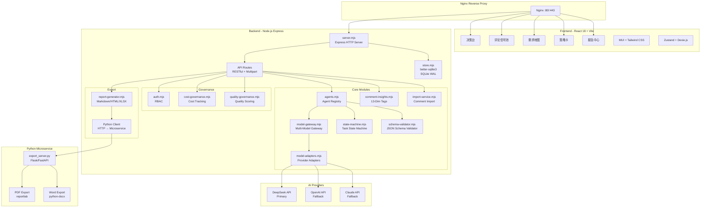
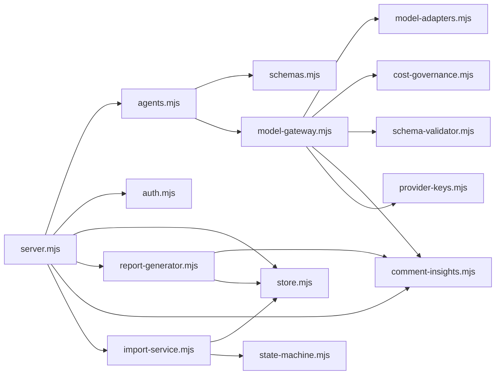
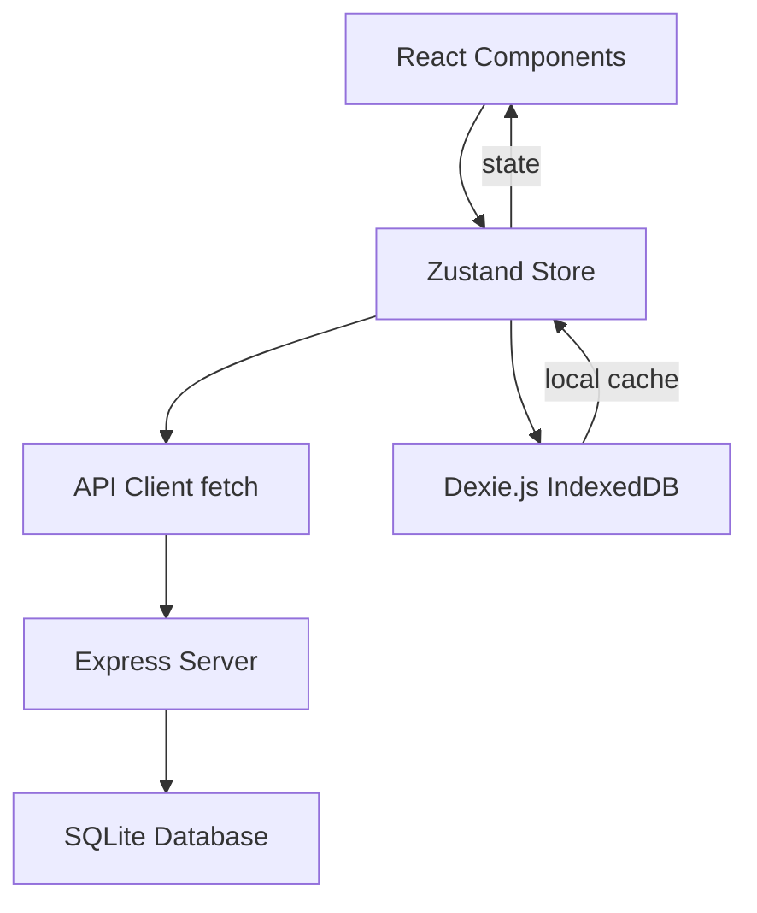
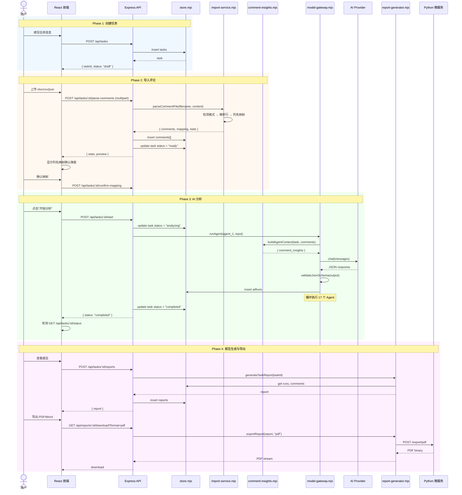
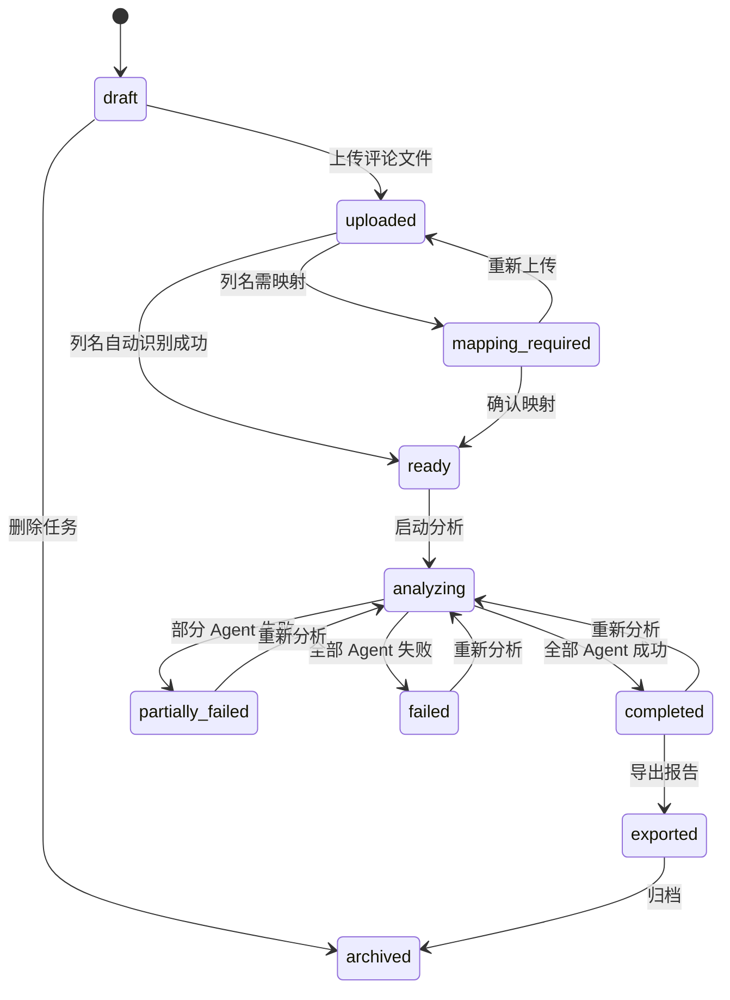
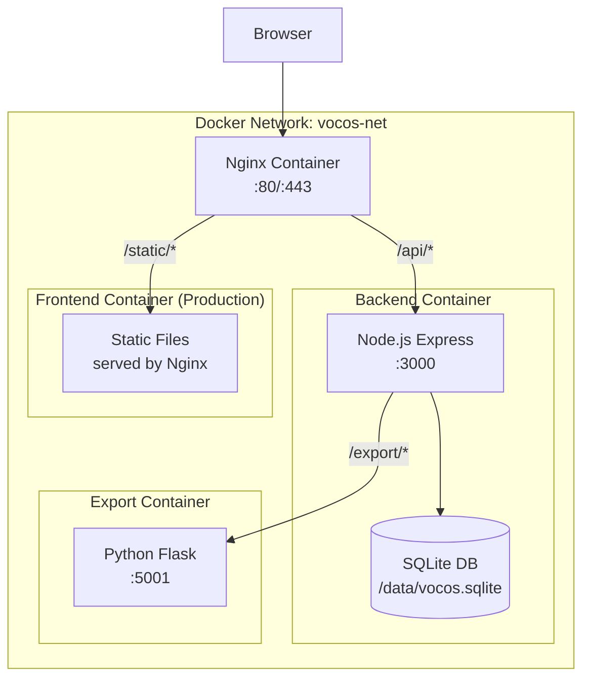

# Vocos 重构系统架构设计

> **版本**：v1.0
> **作者**：高见远（架构师）
> **日期**：2026-06-04
> **状态**：草案
> **基于**：PRD-REFACTOR-INCREMENTAL.md v1.0

---

## 目录

1. [系统架构总览](#1-系统架构总览)
2. [后端文件列表](#2-后端文件列表)
3. [前端文件列表](#3-前端文件列表)
4. [数据库 Schema](#4-数据库-schema)
5. [API 接口设计](#5-api-接口设计)
6. [Agent 列表与 Schema](#6-agent-列表与-schema)
7. [Python 微服务接口](#7-python-微服务接口)
8. [核心流程设计](#8-核心流程设计)
9. [Docker 部署架构](#9-docker-部署架构)
10. [数据迁移方案](#10-数据迁移方案)

---

## 1. 系统架构总览

### 1.1 整体架构图



### 1.2 模块依赖关系



### 1.3 技术栈

| 层面 | 选型 | 说明 |
|------|------|------|
| 后端运行时 | Node.js 18+ | LTS 版本 |
| Web 框架 | Express 4.x | 路由、中间件、静态文件 |
| 数据库 | better-sqlite3 | 同步 API，WAL 模式，性能优于 sqlite3 |
| AI 编排 | agents.mjs + model-gateway.mjs | Agent 注册 + 多模型网关 |
| Schema 验证 | schema-validator.mjs (draft-07) | 自实现轻量验证器 |
| PDF 导出 | reportlab (Python 微服务) | 保留部署版能力 |
| Word 导出 | python-docx (Python 微服务) | 保留部署版能力 |
| 前端框架 | React 18 + TypeScript 5 | SPA |
| 构建工具 | Vite 5 | 极速 HMR |
| 组件库 | MUI 6 Material UI | 成熟数据表格/表单组件 |
| 样式 | Tailwind CSS 3.4 | 与 MUI 互补 |
| 状态管理 | Zustand 4.5 | 轻量，persist 中间件 |
| 本地缓存 | Dexie.js 4.x | IndexedDB 封装 |
| 路由 | React Router 6.x | SPA 路由 |
| 图表 | Recharts 2.x | React 原生声明式 |
| 文件解析 | SheetJS (xlsx) + csv-parse | Excel/CSV 导入导出 |
| 容器化 | Docker + docker-compose | 多阶段构建 |
| Web 服务器 | Nginx | 反向代理 + 静态资源 |

---

## 2. 后端文件列表

### 2.1 模块总览

```
backend/
├── package.json
├── Dockerfile
├── .env.example
├── src/
│   ├── server.mjs              # Express HTTP 服务入口（路由注册、中间件、启动）
│   ├── store.mjs               # 数据层（better-sqlite3 封装，CRUD，迁移）
│   ├── sqlite-relational.mjs   # SQLite 关系表映射（collections → tables 同步）
│   ├── agents.mjs              # Agent 注册表（名称、Schema、重试、超时配置）
│   ├── schemas.mjs             # Agent 输入/输出 JSON Schema 定义 + Prompt 模板
│   ├── model-gateway.mjs       # 多模型网关（runAgent 编排、路由、回退、成本策略）
│   ├── model-adapters.mjs      # 模型适配器（DeepSeek/OpenAI HTTP 调用、JSON 修复）
│   ├── provider-keys.mjs       # Provider API Key 加密存储管理
│   ├── comment-insights.mjs    # 13 维中文评论标签体系 + 评论信号分析
│   ├── import-service.mjs      # 评论文件导入服务（xlsx/csv/json 解析 + 字段映射）
│   ├── file-parser.mjs         # 文件解析器（检测格式、列名映射、字段识别）
│   ├── schema-validator.mjs    # JSON Schema 验证器（draft-07 子集）
│   ├── state-machine.mjs       # 任务状态机（10 状态 + 合法转换矩阵）
│   ├── auth.mjs                # RBAC 认证授权（5 角色 + 15 权限 + 团队隔离）
│   ├── cost-governance.mjs     # 成本治理（Token 用量、预算告警、降级策略）
│   ├── quality-governance.mjs  # 质量治理（输出评分、Schema 合规率、人工反馈）
│   ├── report-generator.mjs    # 报告生成（Markdown/HTML/XLSX 组装）
│   ├── export-client.mjs       # Python 微服务 HTTP 客户端（PDF/Word 导出）
│   ├── xlsx-exporter.mjs       # XLSX 格式导出工具
│   ├── text-utils.mjs          # 文本处理工具（文件名脱敏、编码等）
│   ├── multipart.mjs           # Multipart 表单解析（文件上传）
│   └── task-pipeline.mjs       # 任务流水线编排（批量 Agent 调度）
├── data/
│   ├── vocos.sqlite            # SQLite 数据库文件
│   └── uploads/                # 上传文件临时存储
├── db/
│   ├── schema.sql              # 数据库建表语句
│   ├── seed.sql                # 种子数据
│   └── migrations/             # 迁移脚本目录
│       ├── 001_initial.sql
│       ├── 002_13dim_tags.sql
│       └── 003_rbac_roles.sql
└── tests/
    ├── unit/
    ├── integration/
    └── fixtures/
```

### 2.2 核心模块职责说明

| 文件 | 职责 | 对齐 Codex | 对表部署版 |
|------|------|------------|-----------|
| `server.mjs` | Express 应用入口，注册路由和中间件，启动 HTTP 服务 | ✅ 复用路由匹配模式 | app.py → 重写 |
| `store.mjs` | better-sqlite3 封装，提供 CRUD + 迁移管理 + WAL 模式 | ✅ 复用双模式（JSON/SQLite） | db/schema.sql → 升级 |
| `agents.mjs` | 15 个 Agent 注册表，含名称/版本/Schema ID/重试/超时/成本限制 | ✅ 复用 Agent 结构 | agent_service.py → 迁移 Prompt |
| `schemas.mjs` | Agent 输出 JSON Schema 定义 + Prompt 模板管理 | ✅ 复用 Schema 框架 | 新增（部署版无 Schema 验证） |
| `model-gateway.mjs` | runAgent 编排、模型路由决策、回退、成本策略评估 | ✅ 完整复用 | 新增（部署版单模型直连） |
| `model-adapters.mjs` | 模型提供商 HTTP 调用适配、JSON 响应解析与修复 | ✅ 完整复用 | 新增 |
| `comment-insights.mjs` | 13 维中文标签分类 + 评论信号聚合分析 | ✅ 完整复用 | VALUE_CATEGORIES → 替换 |
| `import-service.mjs` | xlsx/csv/json 文件解析、20+ 字段自动识别映射 | 新增模块 | app.py 导入逻辑 → 迁移 |
| `state-machine.mjs` | 任务 10 状态枚举 + 合法转换矩阵 | ✅ 完整复用 | ai_runs/ai_run_steps → 统一 |
| `auth.mjs` | RBAC（5 角色 + 15 权限 + 团队隔离） | ✅ 完整复用 | auth_service.py → 升级 |
| `cost-governance.mjs` | Token 用量记录、预算告警、自动降级 | ✅ 完整复用 | 新增 |
| `quality-governance.mjs` | 输出质量评分、Schema 合规率、反馈闭环 | ✅ 完整复用 | 新增 |
| `report-generator.mjs` | 报告组装（Markdown/HTML/XLSX） | ✅ 复用 + 扩展 PDF/Word | export_service.py → 微服务化 |
| `export-client.mjs` | Node.js HTTP 客户端，调用 Python 微服务导出 PDF/Word | 新增模块 | export_service.py → HTTP 封装 |

### 2.3 新增模块说明

| 文件 | 创建原因 | 核心功能 |
|------|----------|---------|
| `import-service.mjs` | 部署版有评论导入能力需迁移 | xlsx/csv/json 文件检测 → 列名映射 → 数据校验 → 入库 |
| `export-client.mjs` | Python 微服务 HTTP 调用封装 | POST /export/pdf + POST /export/word → 文件流返回 |
| `task-pipeline.mjs` | 独立流水线编排逻辑 | 从 server.mjs 抽取 Pipeline 执行器，支持单个/批量 Agent 调度 |

---

## 3. 前端文件列表

### 3.1 Feature 结构

```
frontend/
├── index.html
├── package.json
├── tsconfig.json
├── vite.config.ts
├── tailwind.config.ts
├── public/
│   └── favicon.ico
└── src/
    ├── main.tsx                 # React 入口
    ├── App.tsx                  # 根组件（路由 + 布局）
    │
    ├── features/
    │   ├── dashboard/           # 决策台（P0）
    │   │   ├── DashboardPage.tsx
    │   │   ├── ProjectOverview.tsx
    │   │   ├── TaskList.tsx
    │   │   ├── CostWidget.tsx
    │   │   └── QualityWidget.tsx
    │   │
    │   ├── signals/             # 评论信号池（P0）
    │   │   ├── SignalPoolPage.tsx
    │   │   ├── FileUploader.tsx
    │   │   ├── ColumnMapping.tsx
    │   │   ├── SignalChart.tsx
    │   │   ├── CommentTable.tsx
    │   │   └── SignalDetail.tsx
    │   │
    │   ├── demands/             # 需求地图（P0）
    │   │   ├── DemandsPage.tsx
    │   │   ├── BarrierMap.tsx
    │   │   ├── NeedClusters.tsx
    │   │   └── SentimentChart.tsx
    │   │
    │   ├── strategy/            # 策略卡（P0）
    │   │   ├── StrategyPage.tsx
    │   │   ├── StrategyCards.tsx
    │   │   ├── ProductionCard.tsx
    │   │   ├── CommentOps.tsx
    │   │   └── PlatformStrategy.tsx
    │   │
    │   ├── reports/             # 报告中心（P0）
    │   │   ├── ReportsPage.tsx
    │   │   ├── ReportList.tsx
    │   │   ├── ReportPreview.tsx
    │   │   ├── ExportPanel.tsx
    │   │   └── ReportDiff.tsx
    │   │
    │   ├── barriers/            # 购买障碍地图（P1）
    │   │   └── BarriersPage.tsx
    │   │
    │   ├── competitors/         # 竞品机会地图（P1）
    │   │   └── CompetitorsPage.tsx
    │   │
    │   ├── content-lab/         # 内容实验室（P1）
    │   │   └── ContentLabPage.tsx
    │   │
    │   ├── ai-center/           # AI 分析中心（P1）
    │   │   ├── AiCenterPage.tsx
    │   │   ├── AgentRunList.tsx
    │   │   └── AgentRunDetail.tsx
    │   │
    │   ├── review/              # 复盘归因（P2）
    │   │   └── ReviewPage.tsx
    │   │
    │   ├── brand/               # 品牌中心（P2）
    │   │   └── BrandPage.tsx
    │   │
    │   ├── benchmark/           # 对标中心（P2）
    │   │   └── BenchmarkPage.tsx
    │   │
    │   ├── settings/            # 系统设置
    │   │   ├── SettingsPage.tsx
    │   │   ├── ModelProviders.tsx
    │   │   ├── ApiKeys.tsx
    │   │   └── TeamManagement.tsx
    │   │
    │   └── governance/          # 治理面板
    │       ├── CostGovernance.tsx
    │       └── QualityGovernance.tsx
    │
    ├── shared/
    │   ├── types/               # TypeScript 类型定义
    │   │   ├── task.ts
    │   │   ├── comment.ts
    │   │   ├── agent.ts
    │   │   ├── report.ts
    │   │   ├── signal.ts
    │   │   ├── governance.ts
    │   │   └── api.ts
    │   │
    │   ├── db/                  # Dexie.js 数据库
    │   │   ├── index.ts         # DB 实例
    │   │   ├── comments.ts      # 评论表
    │   │   ├── tasks.ts         # 任务表
    │   │   ├── cache.ts         # 缓存表
    │   │   └── migrations.ts    # IndexedDB 迁移
    │   │
    │   ├── stores/              # Zustand stores
    │   │   ├── useTaskStore.ts
    │   │   ├── useSignalStore.ts
    │   │   ├── useReportStore.ts
    │   │   ├── useAgentRunStore.ts
    │   │   ├── useGovernanceStore.ts
    │   │   └── useAuthStore.ts
    │   │
    │   ├── hooks/               # 自定义 React hooks
    │   │   ├── useApi.ts        # API 请求 hook
    │   │   ├── usePolling.ts    # 轮询 hook（任务状态）
    │   │   ├── useFileUpload.ts # 文件上传 hook
    │   │   └── useLocalCache.ts # 本地缓存 hook
    │   │
    │   ├── utils/               # 工具函数
    │   │   ├── api.ts           # API 客户端（fetch 封装）
    │   │   ├── format.ts        # 数据格式化
    │   │   ├── file.ts          # 文件处理
    │   │   └── constants.ts     # 常量
    │   │
    │   └── components/          # 共享 UI 组件
    │       ├── Layout.tsx       # 全局布局（侧边栏 + 顶栏）
    │       ├── Sidebar.tsx
    │       ├── Topbar.tsx
    │       ├── Loading.tsx
    │       ├── ErrorBoundary.tsx
    │       ├── ConfirmDialog.tsx
    │       └── EmptyState.tsx
    │
    └── app/
        ├── router.tsx           # 路由配置
        └── theme.ts             # MUI + Tailwind 主题
```

### 3.2 前端数据流



---

## 4. 数据库 Schema

### 4.1 完整表结构（对齐 Codex sqlite-relational.mjs）

```sql
-- ============================================
-- 数据库: vocos.sqlite
-- 引擎: SQLite 3.35+ (WAL mode, better-sqlite3)
-- ============================================

PRAGMA journal_mode = WAL;
PRAGMA foreign_keys = ON;

-- ---------- 组织架构 ----------

CREATE TABLE users (
    id TEXT PRIMARY KEY,
    name TEXT NOT NULL,
    email TEXT,
    phone TEXT,
    password_hash TEXT,
    avatar_url TEXT,
    role TEXT NOT NULL DEFAULT 'member',
    default_team_id TEXT,
    status TEXT NOT NULL DEFAULT 'active',
    created_at TEXT NOT NULL,
    updated_at TEXT NOT NULL
);

CREATE TABLE teams (
    id TEXT PRIMARY KEY,
    team_name TEXT NOT NULL,
    owner_user_id TEXT,
    plan_type TEXT DEFAULT 'internal',
    monthly_quota REAL DEFAULT 0,
    used_quota REAL DEFAULT 0,
    status TEXT NOT NULL DEFAULT 'active',
    created_at TEXT NOT NULL,
    updated_at TEXT NOT NULL
);

CREATE TABLE team_members (
    id TEXT PRIMARY KEY,
    team_id TEXT NOT NULL REFERENCES teams(id),
    user_id TEXT NOT NULL REFERENCES users(id),
    role TEXT NOT NULL,
    status TEXT NOT NULL DEFAULT 'active',
    created_at TEXT NOT NULL,
    updated_at TEXT NOT NULL
);

-- ---------- 项目与任务 ----------

CREATE TABLE projects (
    id TEXT PRIMARY KEY,
    team_id TEXT NOT NULL REFERENCES teams(id),
    project_name TEXT NOT NULL,
    brand_name TEXT,
    product_name TEXT,
    industry TEXT,
    description TEXT,
    status TEXT NOT NULL DEFAULT 'active',
    created_by TEXT,
    created_at TEXT NOT NULL,
    updated_at TEXT NOT NULL
);

CREATE TABLE analysis_tasks (
    id TEXT PRIMARY KEY,
    team_id TEXT NOT NULL REFERENCES teams(id),
    project_id TEXT NOT NULL REFERENCES projects(id),
    task_name TEXT NOT NULL,
    platform TEXT NOT NULL,        -- douyin/xiaohongshu/taobao/jd
    content_url TEXT,
    content_title TEXT NOT NULL,
    content_body TEXT,
    content_goal TEXT DEFAULT 'unknown',
    brand_info TEXT,
    product_info TEXT,
    competitor_info TEXT,
    status TEXT NOT NULL DEFAULT 'draft',  -- state-machine 管理
    created_by TEXT,
    created_at TEXT NOT NULL,
    updated_at TEXT NOT NULL,
    started_at TEXT,
    completed_at TEXT
);

-- ---------- 评论数据 ----------

CREATE TABLE comment_files (
    id TEXT PRIMARY KEY,
    task_id TEXT NOT NULL REFERENCES analysis_tasks(id),
    file_name TEXT NOT NULL,
    storage_url TEXT,
    file_type TEXT,                -- xlsx/csv/json
    file_size INTEGER,
    row_count INTEGER,
    mapping_config TEXT,           -- JSON: 列名映射配置
    parse_status TEXT NOT NULL DEFAULT 'uploaded',
    raw_content TEXT,              -- 原始文件内容 base64
    created_at TEXT NOT NULL,
    updated_at TEXT NOT NULL
);

CREATE TABLE comments (
    id TEXT PRIMARY KEY,
    task_id TEXT NOT NULL REFERENCES analysis_tasks(id),
    comment_file_id TEXT REFERENCES comment_files(id),
    comment_id_external TEXT,      -- 外部平台评论 ID
    parent_comment_id TEXT,
    reply_to_comment_id TEXT,
    user_id_hash TEXT,             -- 用户 ID 哈希（隐私保护）
    user_name_hash TEXT,           -- 用户名哈希
    comment_text TEXT NOT NULL,
    normalized_text TEXT,          -- 清洗后文本
    like_count INTEGER DEFAULT 0,
    created_at_external TEXT,      -- 原始发布时间
    ip_location TEXT,              -- IP 属地（导入字段）
    user_level TEXT,               -- 用户等级（导入字段）
    is_author_reply INTEGER DEFAULT 0,
    source_hash TEXT,              -- 去重哈希
    clean_status TEXT DEFAULT 'raw',  -- raw/cleaned/deduped
    value_score REAL,              -- 评论价值评分
    sentiment_label TEXT,          -- 情感标签
    intent_label TEXT,             -- 意图标签
    created_at TEXT NOT NULL
);

-- ---------- AI 执行记录 ----------

CREATE TABLE ai_runs (
    id TEXT PRIMARY KEY,
    team_id TEXT NOT NULL,
    project_id TEXT NOT NULL,
    task_id TEXT NOT NULL REFERENCES analysis_tasks(id),
    agent_id TEXT NOT NULL,
    agent_name TEXT NOT NULL,
    agent_version TEXT,
    prompt_id TEXT,
    prompt_version TEXT,
    schema_id TEXT,
    provider_name TEXT NOT NULL,
    model_name TEXT NOT NULL,
    model_route_rule_id TEXT,
    execution_mode TEXT NOT NULL DEFAULT 'mock',  -- mock/live/blocked
    input_token_count INTEGER NOT NULL DEFAULT 0,
    output_token_count INTEGER NOT NULL DEFAULT 0,
    total_token_count INTEGER NOT NULL DEFAULT 0,
    estimated_cost REAL NOT NULL DEFAULT 0,
    actual_cost REAL NOT NULL DEFAULT 0,
    latency_ms INTEGER,
    status TEXT NOT NULL,
    error_code TEXT,
    error_message TEXT,
    warning_code TEXT,
    warning_message TEXT,
    retry_count INTEGER NOT NULL DEFAULT 0,
    retry_of_run_id TEXT,
    fallback_used INTEGER NOT NULL DEFAULT 0,
    fallback_reason TEXT,
    provider_attempts TEXT,        -- JSON
    json_repair_used INTEGER NOT NULL DEFAULT 0,
    input_hash TEXT,
    output_raw TEXT,
    output_json TEXT,              -- JSON: Agent 输出
    schema_validation_status TEXT,
    schema_validation_errors TEXT, -- JSON
    cost_policy_decision TEXT,
    cost_policy_reason TEXT,
    cost_policy_snapshot TEXT,     -- JSON
    created_at TEXT NOT NULL,
    completed_at TEXT,
    created_by TEXT
);

-- ---------- AI 质量反馈 ----------

CREATE TABLE ai_quality_feedback (
    id TEXT PRIMARY KEY,
    team_id TEXT NOT NULL,
    project_id TEXT,
    task_id TEXT,
    ai_run_id TEXT REFERENCES ai_runs(id),
    agent_name TEXT,
    output_type TEXT,
    action TEXT NOT NULL,          -- accepted/edited/regenerated/rejected
    edit_distance_ratio REAL,
    rating INTEGER,                -- 1-5
    comment TEXT,
    created_by TEXT,
    created_at TEXT NOT NULL
);

-- ---------- 报告 ----------

CREATE TABLE reports (
    id TEXT PRIMARY KEY,
    team_id TEXT NOT NULL,
    project_id TEXT NOT NULL,
    task_id TEXT NOT NULL REFERENCES analysis_tasks(id),
    title TEXT NOT NULL,
    format TEXT NOT NULL DEFAULT 'markdown',
    status TEXT NOT NULL DEFAULT 'generated',
    summary TEXT,
    markdown TEXT,                 -- Markdown 源码
    metrics TEXT,                  -- JSON
    created_by TEXT,
    created_at TEXT NOT NULL,
    updated_at TEXT NOT NULL
);

-- ---------- 治理相关 ----------

CREATE TABLE audit_logs (
    id TEXT PRIMARY KEY,
    team_id TEXT,
    user_id TEXT,
    role TEXT,
    action TEXT NOT NULL,
    resource_type TEXT NOT NULL,
    resource_id TEXT,
    metadata TEXT,                 -- JSON
    created_at TEXT NOT NULL
);

CREATE TABLE task_pipeline_jobs (
    task_id TEXT PRIMARY KEY REFERENCES analysis_tasks(id),
    status TEXT NOT NULL,
    started_at TEXT,
    completed_at TEXT,
    completed_agents INTEGER NOT NULL DEFAULT 0,
    total_agents INTEGER NOT NULL DEFAULT 0,
    error TEXT,
    updated_at TEXT NOT NULL
);

-- ---------- AI 配置 ----------

CREATE TABLE model_providers (
    id TEXT PRIMARY KEY,
    provider_name TEXT NOT NULL,
    base_url TEXT NOT NULL,
    api_key_encrypted TEXT,
    api_key_masked TEXT,
    key_updated_at TEXT,
    key_updated_by TEXT,
    status TEXT NOT NULL DEFAULT 'disabled',
    created_at TEXT NOT NULL,
    updated_at TEXT NOT NULL
);

CREATE TABLE model_configs (
    id TEXT PRIMARY KEY,
    provider_id TEXT NOT NULL REFERENCES model_providers(id),
    model_name TEXT NOT NULL,
    model_type TEXT,
    context_window INTEGER,
    input_token_price REAL,
    output_token_price REAL,
    rate_limit_per_minute INTEGER,
    timeout_seconds INTEGER,
    is_active INTEGER DEFAULT 1,
    created_at TEXT NOT NULL,
    updated_at TEXT NOT NULL
);

CREATE TABLE ai_agents (
    id TEXT PRIMARY KEY,
    agent_name TEXT NOT NULL,
    agent_code TEXT NOT NULL UNIQUE,
    agent_version TEXT NOT NULL,
    description TEXT,
    input_schema_id TEXT,
    output_schema_id TEXT,
    default_prompt_id TEXT,
    default_model TEXT,
    fallback_model TEXT,
    max_retries INTEGER,
    timeout_seconds INTEGER,
    cost_limit REAL,
    status TEXT NOT NULL DEFAULT 'active',
    created_at TEXT NOT NULL,
    updated_at TEXT NOT NULL
);

CREATE TABLE ai_prompts (
    id TEXT PRIMARY KEY,
    agent_code TEXT NOT NULL,
    prompt_name TEXT NOT NULL,
    current_version_id TEXT,
    status TEXT NOT NULL DEFAULT 'active',
    created_at TEXT NOT NULL,
    updated_at TEXT NOT NULL,
    activated_by TEXT,
    activated_at TEXT
);

CREATE TABLE ai_prompt_versions (
    id TEXT PRIMARY KEY,
    prompt_id TEXT NOT NULL,
    version TEXT NOT NULL,
    system_prompt TEXT NOT NULL,
    user_prompt_template TEXT NOT NULL,
    input_variables TEXT,
    output_schema_id TEXT,
    model_config_id TEXT,
    default_model TEXT,
    status TEXT NOT NULL DEFAULT 'active',
    created_by TEXT,
    created_at TEXT NOT NULL,
    change_log TEXT
);

CREATE TABLE ai_schemas (
    id TEXT PRIMARY KEY,
    schema_name TEXT NOT NULL,
    schema_version TEXT NOT NULL,
    schema_json TEXT NOT NULL,
    status TEXT NOT NULL DEFAULT 'active',
    created_at TEXT NOT NULL,
    updated_at TEXT NOT NULL
);

-- ---------- 迁移记录 ----------

CREATE TABLE schema_migrations (
    id TEXT PRIMARY KEY,
    applied_at TEXT NOT NULL
);

-- ---------- 索引 ----------

CREATE INDEX idx_team_members_team ON team_members(team_id);
CREATE INDEX idx_team_members_user ON team_members(user_id);
CREATE INDEX idx_analysis_tasks_project ON analysis_tasks(project_id);
CREATE INDEX idx_analysis_tasks_status ON analysis_tasks(status);
CREATE INDEX idx_comments_task ON comments(task_id);
CREATE INDEX idx_comments_clean_status ON comments(clean_status);
CREATE INDEX idx_ai_runs_task ON ai_runs(task_id);
CREATE INDEX idx_ai_runs_agent ON ai_runs(agent_name);
CREATE INDEX idx_ai_runs_model ON ai_runs(provider_name, model_name);
CREATE INDEX idx_ai_runs_status ON ai_runs(status);
CREATE INDEX idx_ai_quality_feedback_run ON ai_quality_feedback(ai_run_id);
CREATE INDEX idx_ai_quality_feedback_task ON ai_quality_feedback(task_id);
CREATE INDEX idx_reports_task ON reports(task_id);
CREATE INDEX idx_audit_logs_team ON audit_logs(team_id);
CREATE INDEX idx_audit_logs_user ON audit_logs(user_id);
CREATE INDEX idx_ai_prompt_versions_prompt ON ai_prompt_versions(prompt_id);
CREATE INDEX idx_task_pipeline_jobs_status ON task_pipeline_jobs(status);
```

### 4.2 与部署版数据库对表

| 部署版表 | Codex 新表 | 变更说明 |
|----------|-----------|---------|
| comments | comments | 字段扩展：新增 13 维标签字段（clean_status, value_score, sentiment_label, intent_label） |
| ai_runs | ai_runs | 完全重新设计：新增 provider/model/schema/cost/latency 等治理字段 |
| ai_run_steps | （合并到 ai_runs） | 用 provider_attempts 数组记录每一步 |
| strategies | reports | 合并到报告体系，通过 report-generator 生成 |
| reports | reports | 保留结构，新增 format/summary/metrics 字段 |
| users | users | 对齐 RBAC，新增 role/default_team_id |
| projects | projects | 新增 brand_name/product_name/industry |
| value_categories | （删除） | 替换为 comment-insights.mjs 13 维标签 |
| — | teams | 新增：多租户支持 |
| — | team_members | 新增：团队成员管理 |
| — | model_providers | 新增：模型提供商配置 |
| — | model_configs | 新增：模型参数配置 |
| — | ai_agents | 新增：Agent 元数据 |
| — | ai_prompts | 新增：Prompt 版本管理 |
| — | ai_prompt_versions | 新增：Prompt 历史版本 |
| — | ai_schemas | 新增：JSON Schema 管理 |
| — | ai_quality_feedback | 新增：人工反馈闭环 |
| — | audit_logs | 新增：操作审计 |
| — | schema_migrations | 新增：迁移版本控制 |

---

## 5. API 接口设计

### 5.1 接口总览

所有接口前缀 `/api`，返回 JSON（除文件下载外）。

| 方法 | 路径 | 说明 | 权限 |
|------|------|------|------|
| **系统** | | | |
| GET | /health | 健康检查 | public |
| GET | /api/auth/context | 获取当前用户上下文 | authenticated |
| GET | /api/schema | 获取系统 Schema（枚举值） | authenticated |
| **任务管理** | | | |
| GET | /api/tasks | 任务列表 | task:read |
| POST | /api/tasks | 创建任务 | task:write |
| GET | /api/tasks/:taskId | 任务详情（含关联数据计数） | task:read |
| GET | /api/tasks/:taskId/status | 任务状态 + 流水线进度 | task:read |
| POST | /api/tasks/:taskId/start | 启动分析流水线 | task:write |
| **评论管理** | | | |
| POST | /api/tasks/:taskId/parse-comments | 上传并解析评论文件 | task:write |
| POST | /api/tasks/:taskId/confirm-mapping | 确认列名映射 | task:write |
| GET | /api/tasks/:taskId/comment-signals | 评论信号池分析结果 | task:read |
| GET | /api/tasks/:taskId/comment-signals/:signalKey/comments | 按信号标签筛选评论 | task:read |
| **AI 执行** | | | |
| GET | /api/tasks/:taskId/agent-runs | 任务的 AI 执行记录 | ai_run:read |
| GET | /api/ai/runs | AI 执行记录列表（支持筛选） | ai_run:read |
| GET | /api/ai/runs/:runId | AI 执行详情 | ai_run:read |
| POST | /api/ai/runs/:runId/retry | 重试 AI 执行 | ai_run:write |
| POST | /api/ai/run-agent | 单个 Agent 手动执行 | ai_run:write |
| GET | /api/ai/runs/:runId/feedback | 获取 AI 输出的反馈记录 | ai_run:read |
| POST | /api/ai/runs/:runId/feedback | 提交 AI 输出反馈 | ai_run:write |
| **Schema 管理** | | | |
| GET | /api/ai/schemas | Schema 列表 | schema:read |
| POST | /api/ai/schemas | 创建 Schema | schema:write |
| GET | /api/ai/schemas/:id | Schema 详情 | schema:read |
| POST | /api/ai/schemas/:id/status | 更新 Schema 状态 | schema:write |
| POST | /api/ai/schemas/:id/validate | 验证 JSON 数据 | schema:read |
| **Prompt 管理** | | | |
| GET | /api/ai/prompts | Prompt 列表 | prompt:read |
| GET | /api/ai/prompts/:id | Prompt 详情 | prompt:read |
| POST | /api/ai/prompts/:id/versions | 创建 Prompt 版本 | prompt:write |
| POST | /api/ai/prompts/:id/activate | 激活 Prompt 版本 | prompt:write |
| **模型网关** | | | |
| GET | /api/model-gateway/routes | 模型路由配置 | model:read |
| GET | /api/model-gateway/providers | 模型提供商状态 | model:read |
| POST | /api/model-gateway/providers/:name/key | 设置 API Key | model:write |
| POST | /api/model-gateway/providers/:name/key/delete | 删除 API Key | model:write |
| POST | /api/model-gateway/providers/:name/test | 测试提供商连接 | model:read |
| **报告** | | | |
| GET | /api/tasks/:taskId/reports | 任务报告列表 | report:read |
| POST | /api/tasks/:taskId/reports | 生成报告 | report:write |
| GET | /api/reports/:reportId | 报告详情 | report:read |
| GET | /api/reports/:reportId/download | 下载报告（支持 format 参数） | report:read |
| **治理** | | | |
| GET | /api/governance/cost-summary | 成本摘要 | cost:read |
| GET | /api/governance/quality-summary | 质量摘要 | quality:read |
| GET | /api/audit-logs | 审计日志 | audit:read |

### 5.2 关键接口请求/响应示例

#### POST /api/tasks — 创建任务

```json
// Request
{
  "taskName": "某美妆品牌 5 月抖音分析",
  "platform": "douyin",
  "contentTitle": "开局一对眼膜",
  "contentUrl": "https://www.douyin.com/video/xxx",
  "contentBody": "产品描述...",
  "contentGoal": "conversion",
  "brandInfo": "AURA LAB",
  "productInfo": "仙人掌透皮眼膜"
}

// Response 201
{
  "data": {
    "id": "task_abc123",
    "teamId": "team_demo",
    "projectId": "project_demo",
    "taskName": "某美妆品牌 5 月抖音分析",
    "platform": "douyin",
    "status": "draft",
    "createdAt": "2026-06-04T10:00:00.000Z"
  }
}
```

#### POST /api/tasks/:id/parse-comments — 上传评论文件

- Content-Type: `multipart/form-data`
- 字段：`file` (文件) + `platform` + `mapping` (可选列名映射)
- 支持格式：xlsx, csv, json

```json
// Response 201
{
  "data": {
    "file": { "id": "file_xyz", "fileName": "comments.xlsx", "rowCount": 1523 },
    "mapping": {
      "commentText": "评论内容",
      "likeCount": "点赞量",
      "createdAtExternal": "发布时间"
    },
    "stats": { "parsedRows": 1523, "fieldCount": 8, "needsMapping": false },
    "task": { "id": "task_abc123", "status": "ready" }
  }
}
```

#### GET /api/tasks/:id/comment-signals — 评论信号分析

```json
// Response 200
{
  "data": {
    "taskId": "task_abc123",
    "taskName": "某美妆品牌 5 月抖音分析",
    "source": "comment-insights-rule-v0.2.0",
    "taxonomyVersion": "voc_signal_v0.2.0",
    "totalComments": 1523,
    "classifiedComments": 1204,
    "signalCoverage": 0.79,
    "signals": [
      { "key": "effect_skepticism", "label": "效果怀疑", "count": 342 },
      { "key": "ingredient_focus", "label": "成分关注", "count": 287 }
    ],
    "topBarriers": [ ... ],
    "conversionSignals": [ ... ],
    "contentHooks": [ ... ]
  }
}
```

#### GET /api/reports/:id/download?format=pdf — 下载 PDF 报告

Response: `application/pdf` 二进制流（由 Python 微服务生成）

#### GET /api/reports/:id/download?format=word — 下载 Word 报告

Response: `application/vnd.openxmlformats-officedocument.wordprocessingml.document` 二进制流

---

## 6. Agent 列表与 Schema

### 6.1 Agent 注册表（17 个 Agent，对齐 Codex agents.mjs）

| # | code | 中文名称 | 职责 | 默认模型 | 超时(s) | 重试 |
|---|------|---------|------|---------|---------|------|
| 1 | task_goal_agent | 任务理解与目标识别 | 解析任务业务问题、交付目标、输出范围 | deepseek-v4-flash | 120 | 2 |
| 2 | content_decomposition_agent | 内容拆解分析 | 诊断内容为什么引发评论，识别触发点与证据缺口 | deepseek-v4-flash | 120 | 2 |
| 3 | comment_dedup_agent | 评论去重清洗 | 清洗重复/模板化评论，保留证据性用户语言 | deepseek-v4-flash | 120 | 2 |
| 4 | spam_filter_agent | 水军无效过滤 | 检测低价值、机器人、纯表情、作者回复评论 | deepseek-v4-flash | 120 | 2 |
| 5 | thread_cleanup_agent | 多轮对话清洗 | 重建评论线程父子上下文 | deepseek-v4-flash | 120 | 2 |
| 6 | sentiment_depth_agent | 情感深度分析 | 超越正负面，分析好奇/怀疑/紧迫/焦虑/信任/购买意愿 | deepseek-v4-flash | 120 | 2 |
| 7 | high_value_comment_agent | 高价值评论筛选 | 按决策价值排序提取高价值评论 | deepseek-v4-flash | 120 | 2 |
| 8 | need_barrier_agent | 需求与购买障碍 | 识别真实购买障碍（13 维标签体系） | deepseek-v4-flash | 120 | 2 |
| 9 | content_comment_attribution_agent | 内容-评论归因 | 解释内容元素与评论反应之间的因果关系 | deepseek-v4-flash | 90 | 2 |
| 10 | content_value_type_agent | 内容价值类型识别 | 分类内容提供的价值类型 | deepseek-v4-flash | 90 | 2 |
| 11 | platform_strategy_agent | 平台策略生成 | 评论信号→平台策略（抖音/小红书） | deepseek-v4-pro | 90 | 2 |
| 12 | production_card_agent | 生产卡生成 | 评论信号→可派单短视频脚本 | deepseek-v4-pro | 90 | 2 |
| 13 | comment_operation_agent | 评论区运营 | 基于信号标签的回复话术、置顶方案、风控规则 | deepseek-v4-pro | 90 | 2 |
| 14 | ad_fit_agent | 投流适配评分 | 判断内容是否适合投流 | deepseek-v4-pro | 90 | 2 |
| 15 | pre_publish_check_agent | 发布前质检 | 检查脚本是否准备好发布 | deepseek-v4-pro | 90 | 2 |
| 16 | report_assembly_agent | 报告组装 | 组装面向客户的专业复盘报告 | deepseek-v4-pro | 90 | 2 |
| 17 | ai_quality_eval_agent | AI 质量评估 | 评估所有 Agent 输出质量 | deepseek-v4-pro | 90 | 2 |

> **说明**：部署版 agent_service.py 包含 15 个经过业务验证的 Agent Prompt。迁移时保留原始 Prompt 文本，补充 JSON Schema 和重试配置。
> Codex 有 17 个 Agent，部署版 15 个。差异的 2 个（thread_cleanup_agent, ai_quality_eval_agent）在 Codex 版已定义，部署版如不需要可在 P1 阶段移除。

### 6.2 Agent 输入 Schema（统一）

每个 Agent 接收的输入由 `buildAgentContext()` 统一构建：

```json
{
  "team_id": "team_demo",
  "project_id": "project_demo",
  "task_id": "task_abc123",
  "content_title": "开局一对眼膜",
  "content_body": "...",
  "content_goal": "conversion",
  "platform": "douyin",
  "brand_info": "AURA LAB",
  "product_info": "仙人掌透皮眼膜",
  "comment_count": 1523,
  "comment_insights": {
    "signals": [ ... ],
    "topBarriers": [ ... ],
    "conversionSignals": [ ... ],
    "topComments": [ ... ]
  },
  "value_questions": [
    "这条内容为什么引发这些评论？",
    "用户真正卡在哪里？",
    "下一条内容怎么拍？",
    "脚本怎么写？",
    "评论区怎么运营？",
    "这条内容能不能投流？"
  ]
}
```

### 6.3 Agent 输出 Schema（关键 Agent）

#### report_assembly_agent（报告组装）

```json
{
  "type": "object",
  "required": ["executive_summary", "next_week_plan", "client_deliverables"],
  "properties": {
    "executive_summary": { "type": "string", "minLength": 1 },
    "next_week_plan": { "type": "array", "minItems": 1 },
    "client_deliverables": { "type": "array", "minItems": 1 }
  }
}
```

#### comment_operation_agent（评论区运营）

```json
{
  "type": "object",
  "required": ["comment_ops"],
  "properties": {
    "comment_ops": {
      "type": "object",
      "required": ["pinned_reply", "reply_playbook", "label_reply_suggestions", "dm_triggers", "risk_controls"],
      "properties": {
        "pinned_reply": { "type": "string" },
        "reply_playbook": {
          "type": "array",
          "items": {
            "type": "object",
            "required": ["signal_key", "signal_label", "reply_goal", "suggested_reply"],
            "properties": {
              "signal_key": { "type": "string" },
              "signal_label": { "type": "string" },
              "reply_goal": { "type": "string" },
              "suggested_reply": { "type": "string" },
              "handoff_action": { "type": "string" }
            }
          }
        }
      }
    }
  }
}
```

#### production_card_agent（生产卡）

```json
{
  "type": "object",
  "required": ["production_card"],
  "properties": {
    "production_card": {
      "type": "object",
      "required": ["next_video_brief", "script_outline", "assignable_assets"],
      "properties": {
        "next_video_brief": { "type": "string" },
        "script_outline": { "type": "array", "minItems": 1 },
        "assignable_assets": { "type": "array", "minItems": 1 }
      }
    }
  }
}
```

### 6.4 Prompt 迁移策略

部署版 `agent_service.py` 包含 15 个真实业务 Prompt。迁移步骤：

1. **提取 Prompt**：从 `agent_service.py` 提取每个 Agent 的 system prompt 和 user prompt template
2. **包装为标准格式**：将 Prompt 包装为 `{ systemPrompt, userPromptTemplate }` 格式
3. **关联 Schema**：为每个 Agent 关联输出 JSON Schema ID
4. **注册到 schemas.mjs**：写入 `AGENT_SPECIALIZED_PROMPTS` 数组
5. **保留原始文本**：不做任何语义修改，仅做格式适配

Prompt 迁移伪代码示例：

```javascript
// 部署版某个 Agent（以 comment_operation_agent 为例）
// 原始 Prompt 保留在部署版 agent_service.py 中
// 迁移后格式：

{
  id: "comment_operation_agent_prompt",
  agentCode: "comment_operation_agent",
  name: "Comment Operation Agent Prompt",
  currentVersion: "v1.0.0",
  versions: [{
    version: "v1.0.0",
    outputSchemaId: "comment_operation_agent_output_v1",
    systemPrompt: "【从 agent_service.py 完整复制】",
    userPromptTemplate: "【从 agent_service.py 完整复制】",
    changeLog: "Migrated from deployment agent_service.py v1.0"
  }]
}
```

---

## 7. Python 微服务接口

### 7.1 架构

```
Node.js (export-client.mjs)  →  HTTP POST  →  Python (export_server.py)
      ↓                                              ↓
  JSON input                                    PDF/Word binary
  (report markdown)                             (reportlab / python-docx)
```

### 7.2 API 设计

Python 微服务运行在 `http://export-service:5001`

#### POST /export/pdf

```json
// Request
{
  "reportId": "report_abc",
  "title": "某品牌 5 月复盘报告",
  "markdown": "# Executive Summary\n...",
  "options": {
    "template": "default",
    "pageSize": "A4",
    "fontFamily": "SimSun"
  }
}

// Response
// Content-Type: application/pdf
// Body: PDF binary
```

#### POST /export/word

```json
// Request
{
  "reportId": "report_abc",
  "title": "某品牌 5 月复盘报告",
  "markdown": "# Executive Summary\n...",
  "options": {
    "template": "default"
  }
}

// Response
// Content-Type: application/vnd.openxmlformats-officedocument.wordprocessingml.document
// Body: DOCX binary
```

#### GET /export/health

```json
// Response 200
{ "ok": true, "service": "vocos-export-service", "version": "1.0.0" }
```

### 7.3 export-client.mjs 设计

```javascript
// backend/src/export-client.mjs
export async function exportPdf(markdown, options = {}) {
  const response = await fetch(`${EXPORT_SERVICE_URL}/export/pdf`, {
    method: "POST",
    headers: { "Content-Type": "application/json" },
    body: JSON.stringify({ markdown, ...options })
  });
  if (!response.ok) throw new Error(`PDF export failed: ${response.status}`);
  return Buffer.from(await response.arrayBuffer());
}

export async function exportWord(markdown, options = {}) {
  const response = await fetch(`${EXPORT_SERVICE_URL}/export/word`, {
    method: "POST",
    headers: { "Content-Type": "application/json" },
    body: JSON.stringify({ markdown, ...options })
  });
  if (!response.ok) throw new Error(`Word export failed: ${response.status}`);
  return Buffer.from(await response.arrayBuffer());
}
```

### 7.4 Python 微服务实现

```python
# export_server.py
from flask import Flask, request, send_file
import reportlab
# 复用部署版 export_service.py 的核心逻辑

app = Flask(__name__)

@app.route("/export/pdf", methods=["POST"])
def export_pdf():
    data = request.json
    pdf_bytes = generate_pdf(data["markdown"], data.get("options", {}))
    return send_file(pdf_bytes, mimetype="application/pdf")

@app.route("/export/word", methods=["POST"])
def export_word():
    data = request.json
    docx_bytes = generate_docx(data["markdown"], data.get("options", {}))
    return send_file(docx_bytes, mimetype="application/vnd.openxmlformats-officedocument.wordprocessingml.document")
```

---

## 8. 核心流程设计

### 8.1 评论导入 → AI 分析 → 策略生成 → 报告导出 全流程



### 8.2 任务状态机



---

## 9. Docker 部署架构

### 9.1 容器拓扑



### 9.2 docker-compose.yml

```yaml
version: "3.8"
services:
  nginx:
    image: nginx:alpine
    ports:
      - "80:80"
      - "443:443"
    volumes:
      - ./nginx.conf:/etc/nginx/nginx.conf
      - ./frontend/dist:/usr/share/nginx/html
    depends_on:
      - backend
    networks:
      - vocos-net

  backend:
    build:
      context: ./backend
      dockerfile: Dockerfile
    ports:
      - "3000:3000"
    volumes:
      - ./backend/data:/app/data
      - ./backend/uploads:/app/uploads
    environment:
      - NODE_ENV=production
      - VOCOS_STORE_DRIVER=sqlite
      - VOCOS_SQLITE_PATH=/app/data/vocos.sqlite
      - VOCOS_MODEL_MODE=live
      - DEEPSEEK_API_KEY=${DEEPSEEK_API_KEY}
      - OPENAI_API_KEY=${OPENAI_API_KEY}
      - EXPORT_SERVICE_URL=http://export-service:5001
    depends_on:
      - export-service
    networks:
      - vocos-net

  export-service:
    build:
      context: ./export-service
      dockerfile: Dockerfile
    ports:
      - "5001:5001"
    environment:
      - FLASK_ENV=production
    networks:
      - vocos-net

networks:
  vocos-net:
    driver: bridge
```

### 9.3 Nginx 配置要点

```nginx
server {
    listen 80;
    server_name _;

    # 前端静态资源
    location / {
        root /usr/share/nginx/html;
        try_files $uri /index.html;
    }

    # API 反向代理
    location /api/ {
        proxy_pass http://backend:3000;
        proxy_set_header Host $host;
        proxy_set_header X-Real-IP $remote_addr;
    }

    # 文件上传大小限制
    client_max_body_size 50m;
}
```

---

## 10. 数据迁移方案

### 10.1 迁移策略

```
旧数据库（部署版）              新数据库（重构版）
┌─────────────────┐           ┌─────────────────┐
│ comments        │── 1:1 ──→│ comments        │ 字段映射+新增
│ ai_runs         │── 映射──→│ ai_runs         │ 字段重构
│ ai_run_steps     │── 合并──→│ ai_runs.provider_attempts │
│ strategies      │── 转换──→│ reports         │ 格式转换
│ reports         │── 1:1 ──→│ reports         │ 保留
│ users           │── 升级──→│ users           │ RBAC扩展
│ projects        │── 1:1 ──→│ projects        │ 扩展
│ value_categories│── 替换──→│ (删除)          │ 13维标签替代
└─────────────────┘           └─────────────────┘
```

### 10.2 迁移步骤

1. **全量备份**：`cp vocos.db vocos_backup_$(date +%Y%m%d).db`
2. **运行迁移脚本**：`node backend/db/migrate.js --source /path/to/old.sqlite --target /path/to/new.sqlite`
3. **数据校验**：
   - comments 记录数一致
   - comments 列名映射完整性（抽查 100 条）
   - VALUE_CATEGORIES → 13 维标签映射可追溯
4. **回滚方案**：备份文件可直接恢复

### 10.3 迁移脚本框架

```javascript
// backend/db/migrate.js
import Database from "better-sqlite3";

export async function migrate({ sourcePath, targetPath }) {
  const source = new Database(sourcePath, { readonly: true });
  const target = new Database(targetPath);
  
  // 1. 执行目标 Schema 建表
  target.exec(fs.readFileSync("backend/db/schema.sql", "utf8"));
  
  // 2. 迁移 comments
  const comments = source.prepare("SELECT * FROM comments").all();
  const insertComment = target.prepare(`
    INSERT INTO comments (id, task_id, comment_text, like_count, ...)
    VALUES (?, ?, ?, ?, ...)
  `);
  for (const c of comments) {
    insertComment.run(
      c.id, c.task_id, c.content, c.likes ?? 0,
      c.created_at, c.source_hash, "raw", null, null
    );
  }
  
  // 3. VALUE_CATEGORIES → 13 维标签映射
  const categoryMap = loadCategoryMapping(); // 旧分类 → 新标签
  // ... 转换逻辑
  
  // 4. 迁移 users/projects/reports
  // ... 
  
  // 5. 记录迁移版本
  target.prepare("INSERT INTO schema_migrations VALUES (?, ?)")
    .run("migrate_v1", new Date().toISOString());
  
  source.close();
  target.close();
}
```

### 10.4 VALUE_CATEGORIES → 13 维标签映射表

| 部署版分类 | 13 维标签 | 映射方式 |
|-----------|----------|---------|
| 购买意图 | purchase_intent | 直接映射 |
| 价格异议 | price_objection | 直接映射 |
| 效果怀疑 | effect_skepticism | 直接映射 |
| 安全担忧 | safety_concern | 直接映射 |
| 使用疑问 | usage_question | 直接映射 |
| 竞品比较 | competitor_comparison | 直接映射 |
| 负面体验 | negative_experience | 直接映射 |
| 复购信号 | repurchase_signal | 直接映射 |
| 场景需求 | scenario_need | 直接映射 |
| 成分关注 | ingredient_focus | 直接映射 |
| — | trust_gap | 新增维度 |
| — | audience_fit | 新增维度 |
| — | dm_consult_signal | 新增维度 |

---

> **文档维护**：本文档由架构师高见远维护，架构变更时同步更新。
> **下一步**：产出 TASKS-REFACTOR.md 任务分解列表。
