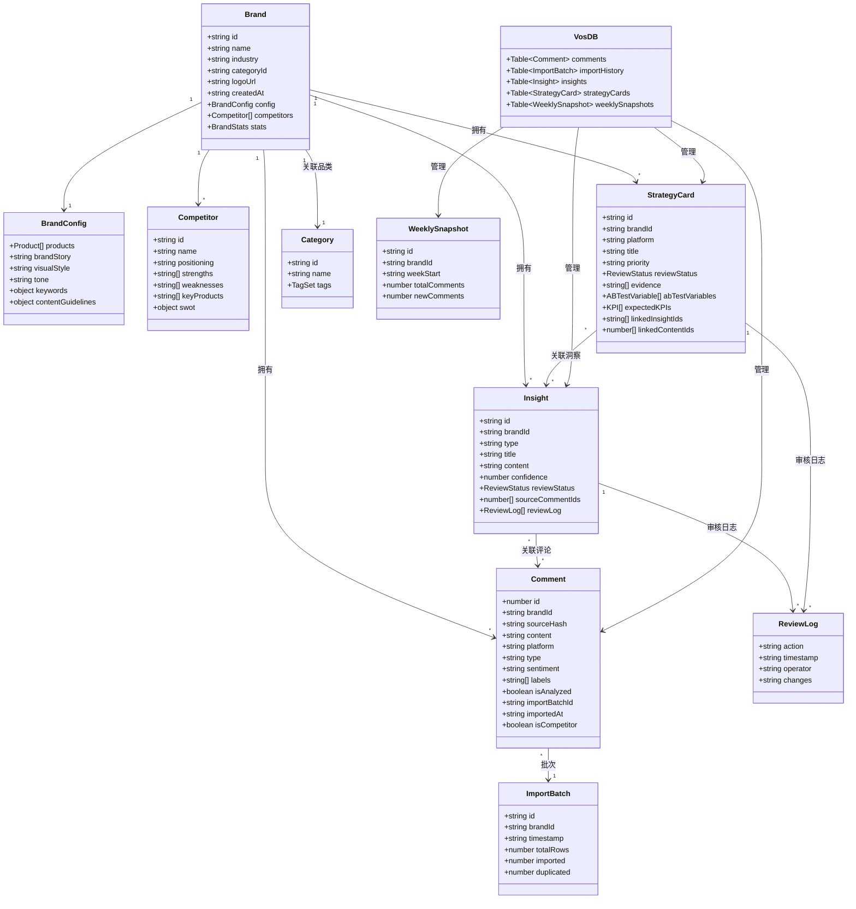
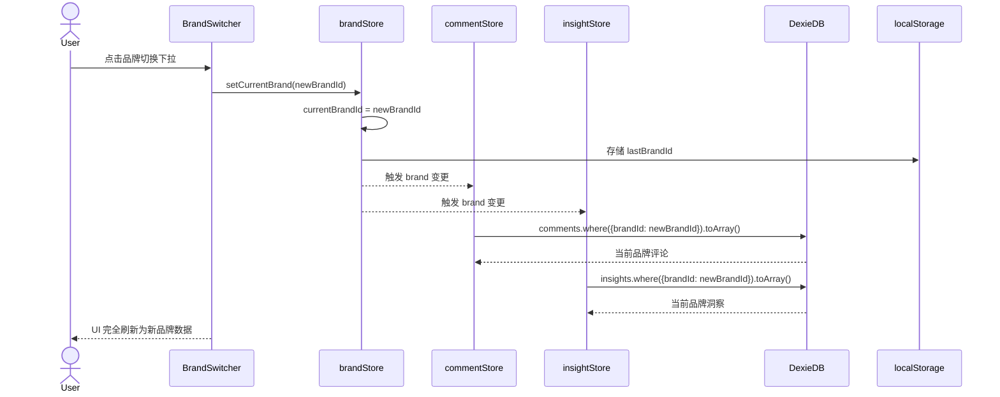
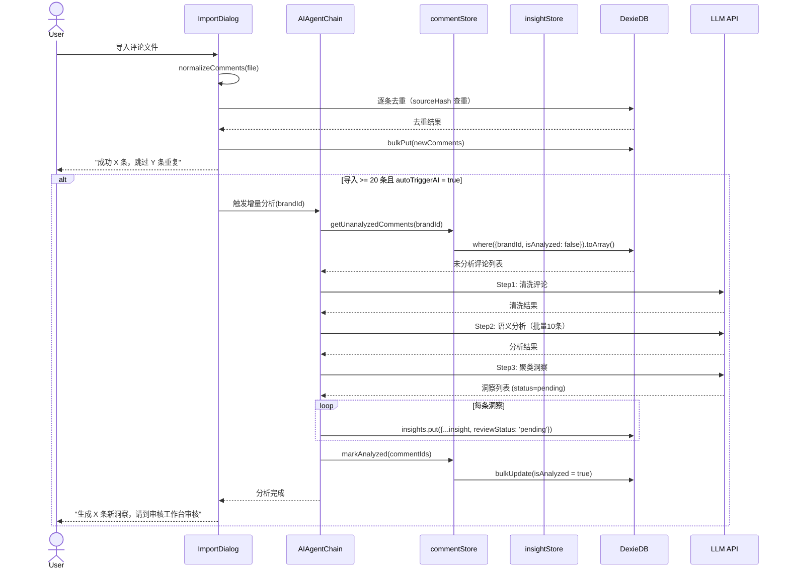
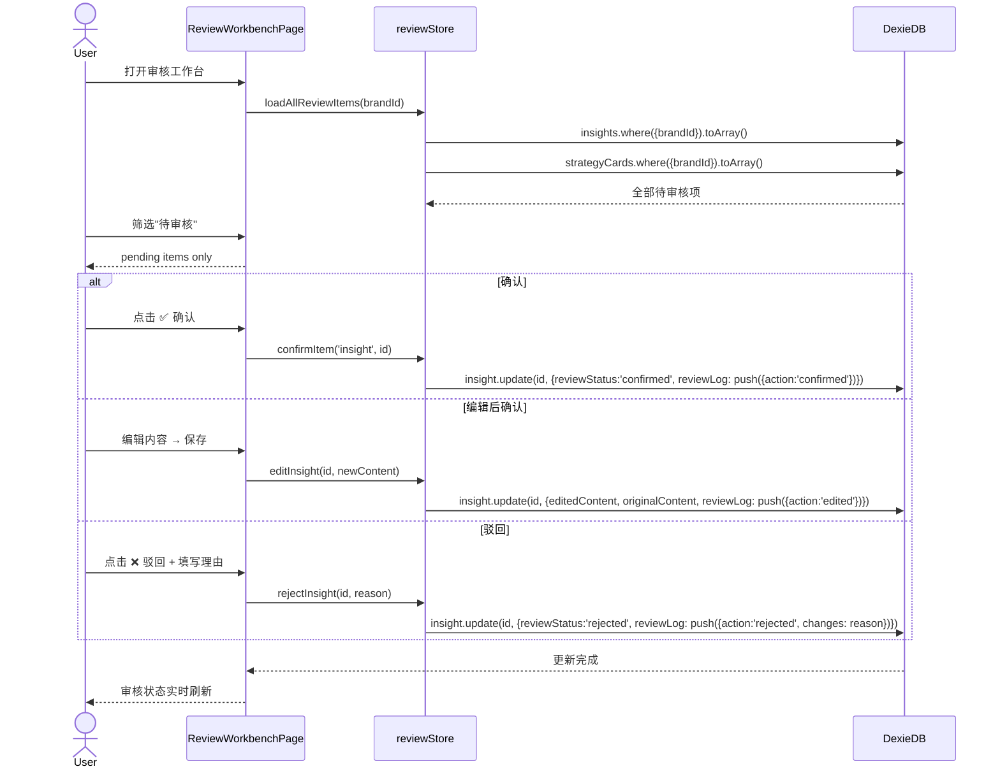
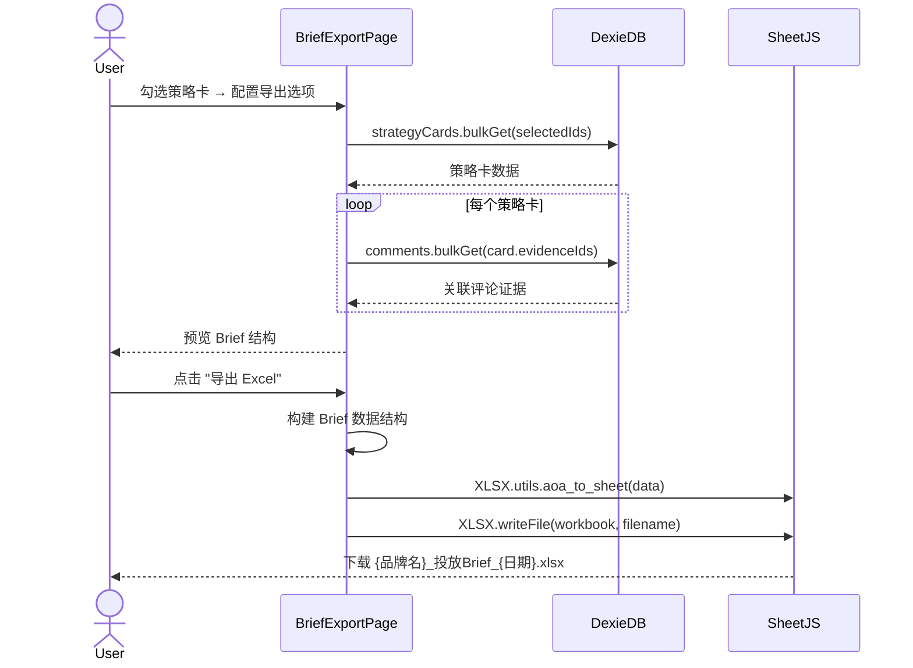
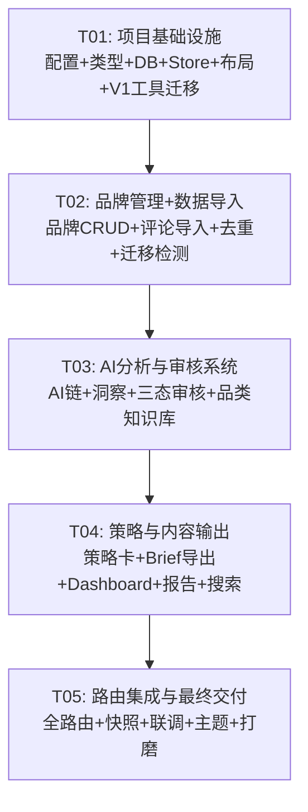

# VOS 2.0 — 系统架构设计 & 任务分解

> 版本：v1.0 | 日期：2025-07-11 | 作者：Bob（架构师）  
> 基于 PRD v1.0 | 目标交付周期：4-6 周（2-3 人团队）

---

## 目录

- [Part A: 系统设计](#part-a-系统设计)
  - [1. 实现方案与框架选型](#1-实现方案与框架选型)
  - [2. 文件列表](#2-文件列表)
  - [3. 核心数据结构与接口](#3-核心数据结构与接口)
  - [4. 关键流程设计](#4-关键流程设计)
  - [5. 待明确事项](#5-待明确事项)
- [Part B: 任务分解](#part-b-任务分解)
  - [6. 依赖包列表](#6-依赖包列表)
  - [7. 任务列表](#7-任务列表)
  - [8. 共享知识](#8-共享知识)
  - [9. 任务依赖图](#9-任务依赖图)

---

# Part A: 系统设计

## 1. 实现方案与框架选型

### 1.1 技术挑战分析

| 挑战 | 难度 | 应对策略 |
|------|------|---------|
| **多品牌数据隔离** | 中 | Dexie.js 复合索引 `[brandId+...]` 天然支持；Zustand 按 brandId 切片 |
| **增量 AI 分析** | 高 | `isAnalyzed: false` 标记 + 导入批次管理；只向 AI 发送新增评论 |
| **大评论量存储** | 中 | IndexedDB 单表可达数百MB；Dexie.js `bulkPut` 批量写入 |
| **去重逻辑** | 中 | 三级去重键：`platformCommentId` → `sourceHash` → 兜底手动 |
| **V1 平滑迁移** | 中 | 首次启动检测 `localStorage` 旧数据 → 读取 → 写入 Dexie `brand_001` |
| **Brief Excel 导出** | 低 | SheetJS (xlsx) 已在 V1 使用，直接延续 |
| **审核工作流** | 中 | 三态状态机 `pending→confirmed/rejected` + 审核日志数组追加 |

### 1.2 技术栈选型

| 层面 | 选型 | 版本 | 理由 |
|------|------|------|------|
| 构建工具 | **Vite** | ^5.x | 极速 HMR，React + TypeScript 开箱支持 |
| UI 框架 | **React 18** + **TypeScript 5** | ^18.3 / ^5.5 | 工程化必需；TypeScript 对复杂数据模型提供类型安全 |
| 组件库 | **MUI (Material UI)** | ^6.x | 成熟的数据表格(DataGrid)、对话框、表单组件；减少重复造轮子 |
| 样式 | **Tailwind CSS** | ^3.4 | 延续 V1 设计语言；与 MUI 互补（布局用 Tailwind，组件用 MUI） |
| 状态管理 | **Zustand** | ^4.5 | 轻量（<2KB）；`persist` 中间件同步 localStorage；支持 `subscribeWithSelector` |
| 数据库 | **Dexie.js** | ^4.x | IndexedDB 最成熟的封装；Promise-based API；支持复合索引和事务 |
| 图表 | **Recharts** | ^2.x | React 原生，声明式 API；轻量（对比 ECharts 体积小 60%） |
| Excel 导出 | **SheetJS (xlsx)** | ^0.20 | V1 已验证；社区成熟；支持 .xlsx 读写 |
| Excel 导入 | **SheetJS (xlsx)** | ^0.20 | 同上，Excel 解析为 JSON 数组 |
| 路由 | **React Router** | ^6.x | 标准 SPA 路由；嵌套路由支持侧边栏布局 |
| UUID | **nanoid** | ^5.x | 轻量 ID 生成（品牌ID、洞察ID、批次ID） |
| 日期处理 | **dayjs** | ^1.11 | 2KB 替代 moment.js；周快照日期计算 |

### 1.3 架构模式

采用 **Feature-based Module** 模式（非传统 MVC），原因：
- 品牌管理、评论池、策略卡等模块内聚性高，适合 Feature 文件夹
- Zustand Store 按模块拆分，避免单一巨型 Store
- V1 从单文件 HTML 升级，Feature 模式降低迁移心智负担

```
src/
├── features/
│   ├── brand/          # 品牌管理模块
│   ├── comments/       # 评论池 + 导入
│   ├── insights/       # 洞察 + 审核
│   ├── strategy/       # 策略卡 + Brief 导出
│   ├── dashboard/      # 数据可视化
│   ├── report/         # 报告中心
│   ├── category/       # 品类知识库
│   └── search/         # 全局搜索
├── shared/             # 跨模块共享
│   ├── types/          # TypeScript 类型定义
│   ├── db/             # Dexie 数据库
│   ├── stores/         # Zustand stores
│   ├── utils/          # 工具函数
│   ├── hooks/          # 自定义 React hooks
│   └── constants/      # 常量
├── app/                # 应用壳
│   ├── layout/         # 全局布局（侧边栏 + 顶栏）
│   ├── router/         # 路由配置
│   └── theme/          # MUI + Tailwind 主题
└── main.tsx            # 入口
```

---

## 2. 文件列表

```
vos2/
├── index.html
├── package.json
├── tsconfig.json
├── tsconfig.node.json
├── vite.config.ts
├── tailwind.config.ts
├── postcss.config.js
├── .env
├── .eslintrc.cjs
├── public/
│   └── favicon.svg
└── src/
    ├── main.tsx                          # React 入口
    ├── App.tsx                           # 应用根组件
    ├── vite-env.d.ts                     # Vite 类型声明
    │
    ├── app/
    │   ├── layout/
    │   │   ├── AppLayout.tsx             # 全局布局（sidebar + topbar + main）
    │   │   ├── Sidebar.tsx               # 侧边导航
    │   │   ├── Topbar.tsx                # 顶栏（品牌切换器 + 搜索 + 设置）
    │   │   └── BrandSwitcher.tsx         # 品牌下拉切换器
    │   ├── router/
    │   │   └── AppRouter.tsx             # React Router 路由配置（全部页面路由）
    │   └── theme/
    │       ├── theme.ts                  # MUI 主题（dark/light）
    │       └── muiTheme.ts               # MUI 组件样式覆盖
    │
    ├── features/
    │   ├── brand/
    │   │   ├── BrandListPage.tsx         # 品牌管理页（卡片+新建/编辑/删除）
    │   │   ├── BrandCard.tsx             # 品牌卡片组件
    │   │   ├── BrandFormDialog.tsx       # 新建/编辑品牌对话框
    │   │   ├── BrandDeleteDialog.tsx     # 删除确认对话框
    │   │   └── BrandKnowledgePage.tsx    # 品牌知识库编辑页
    │   │
    │   ├── comments/
    │   │   ├── CommentPoolPage.tsx       # 评论池列表页（搜索/筛选/分页）
    │   │   ├── ImportDialog.tsx          # 导入对话框（文件上传 + 去重 + 历史）
    │   │   ├── CommentTable.tsx          # 评论数据表格
    │   │   ├── CommentDetailDrawer.tsx   # 评论详情侧边抽屉
    │   │   └── ImportHistoryList.tsx     # 导入历史列表
    │   │
    │   ├── insights/
    │   │   ├── DemandMapPage.tsx         # 需求地图页
    │   │   ├── BarrierMapPage.tsx        # 障碍地图页
    │   │   ├── CompetitorPage.tsx        # 竞品机会页
    │   │   ├── ReviewWorkbenchPage.tsx   # 审核工作台页
    │   │   ├── InsightCard.tsx           # 洞察卡片（含审核操作）
    │   │   ├── ReviewActionBar.tsx       # 审核操作栏（确认/编辑/驳回）
    │   │   └── ReviewLogDrawer.tsx       # 审核日志抽屉
    │   │
    │   ├── strategy/
    │   │   ├── StrategyPage.tsx          # 策略卡列表页（小红书/抖音）
    │   │   ├── StrategyCard.tsx          # 策略卡详情组件
    │   │   ├── StrategyDetailPage.tsx    # 策略卡详情页
    │   │   └── BriefExportPage.tsx       # Brief 导出页
    │   │
    │   ├── content/
    │   │   ├── ContentPoolPage.tsx       # 内容池页
    │   │   └── ContentLabPage.tsx        # 内容实验室页
    │   │
    │   ├── dashboard/
    │   │   ├── DashboardPage.tsx         # 决策台主页
    │   │   ├── MetricsOverview.tsx       # 核心指标总览
    │   │   ├── TrendChart.tsx            # 评论量趋势折线图
    │   │   ├── DistributionChart.tsx     # 需求/障碍分布饼图
    │   │   └── CompetitorChart.tsx       # 竞品声量对比柱状图
    │   │
    │   ├── report/
    │   │   ├── ReportCenterPage.tsx      # 报告中心页
    │   │   └── ReportPreview.tsx         # 报告预览/导出组件
    │   │
    │   ├── category/
    │   │   └── CategoryKnowledgePage.tsx # 品类知识库管理页
    │   │
    │   ├── search/
    │   │   └── GlobalSearch.tsx          # 全局搜索（跨模块）
    │   │
    │   └── ai/
    │       ├── AIWorkbenchPage.tsx       # AI 工作台（手动触发+状态）
    │       └── AIAgentChain.ts           # AI Agent 链调用逻辑（V1 迁移 + 增量）
    │
    ├── shared/
    │   ├── types/
    │   │   ├── brand.ts                  # Brand, Competitor, BrandConfig 类型
    │   │   ├── comment.ts                # Comment, ImportBatch, ImportHistory 类型
    │   │   ├── insight.ts                # Insight, ReviewLog, ReviewStatus 类型
    │   │   ├── strategy.ts              # StrategyCard, BriefExportConfig 类型
    │   │   ├── category.ts              # Category, TagSet 类型
    │   │   └── common.ts                 # 通用类型（分页、API响应、筛选器）
    │   │
    │   ├── db/
    │   │   ├── db.ts                     # Dexie 数据库实例 + 表定义
    │   │   ├── brand.db.ts               # brands 表 CRUD 操作
    │   │   ├── comment.db.ts             # comments 表 CRUD + 去重 + 批量导入
    │   │   ├── insight.db.ts             # insights 表 CRUD + 审核操作
    │   │   ├── strategy.db.ts            # strategyCards 表 CRUD
    │   │   ├── snapshot.db.ts            # weeklySnapshots 表 CRUD
    │   │   └── settings.db.ts            # settings 表（API Key 等）
    │   │
    │   ├── stores/
    │   │   ├── brandStore.ts             # 品牌 Zustand Store（当前品牌、品牌列表）
    │   │   ├── commentStore.ts           # 评论 Zustand Store（当前品牌评论、筛选、分页）
    │   │   ├── insightStore.ts           # 洞察 Zustand Store（当前品牌洞察、审核队列）
    │   │   └── reviewStore.ts            # 审核 Zustand Store（审核状态管理）
    │   │
    │   ├── utils/
    │   │   ├── normalizeComments.ts      # V1 迁移：评论规范化（保留 V1 逻辑）
    │   │   ├── callLLM.ts                # V1 迁移：AI LLM 调用（保留 V1 逻辑）
    │   │   ├── dedup.ts                  # 去重哈希工具函数
    │   │   ├── excel.ts                  # Excel 导入/导出工具（SheetJS 封装）
    │   │   ├── brief.ts                  # Brief Excel 导出构建器
    │   │   ├── date.ts                   # 日期/周计算工具
    │   │   ├── api.ts                    # API Key 加密/解密（V1 迁移）
    │   │   └── migrate.ts               # V1→V2 数据迁移
    │   │
    │   ├── hooks/
    │   │   ├── useCurrentBrand.ts        # 获取当前品牌的 Hook
    │   │   ├── useBrandData.ts           # 根据 brandId 加载品牌相关数据
    │   │   ├── usePagination.ts          # 通用分页 Hook
    │   │   └── useDebounce.ts            # 防抖 Hook
    │   │
    │   └── constants/
    │       ├── platforms.ts              # 平台列表（抖音/小红书/B站/视频号）
    │       ├── tags.ts                   # 默认标签（品类级别）
    │       ├── labels.ts                 # 需求/障碍/场景标签枚举
    │       └── config.ts                 # 应用配置常量
    │
    └── styles/
        ├── index.css                     # 全局样式 + Tailwind 指令
        └── theme.css                     # 主题变量（CSS 自定义属性）
```

---

## 3. 核心数据结构与接口

### 3.1 TypeScript 类型定义

```typescript
// ============ shared/types/brand.ts ============

export interface Brand {
  id: string;                    // nanoid
  name: string;
  industry: string;
  categoryId: string;            // 关联品类ID
  logoUrl: string;
  createdAt: string;             // ISO 8601
  config: BrandConfig;
  competitors: Competitor[];
  stats: BrandStats;
}

export interface BrandConfig {
  products: Product[];
  brandStory: string;
  visualStyle: string;
  tone: string;
  keywords: {
    brandWords: string[];
    categoryWords: string[];
    sceneWords: string[];
    audienceWords: string[];
  };
  contentGuidelines: {
    do: string[];
    dont: string[];
  };
  targetAudience: AudienceSegment[];
}

export interface Product {
  id: string; name: string; price: string;
  keyIngredients: string[]; usp: string; targetUsers: string;
}

export interface AudienceSegment {
  id: string; name: string; description: string; evidenceCount: number;
  painPoints: string[]; contentAngle: string;
}

export interface Competitor {
  id: string;
  name: string;
  positioning: string;
  strengths: string[];
  weaknesses: string[];
  keyProducts: string[];
  swot: { S: string[]; W: string[]; O: string[]; T: string[] };
}

export interface BrandStats {
  totalComments: number;
  confirmedInsights: number;
  strategyCards: { total: number; active: number; draft: number; archived: number };
  lastImportAt: string | null;
}

// ============ shared/types/comment.ts ============

export interface Comment {
  id: number;                    // 自增
  brandId: string;
  sourceHash: string;            // 去重主键：MD5(videoId|userUid|content前50)
  platformCommentId: string;     // 平台原生评论ID（优先去重）
  content: string;
  platform: '抖音' | '小红书' | 'B站' | '视频号';
  category: 'content' | 'product';
  type: 'barrier' | 'demand' | 'comparison' | 'praise' | 'complaint' | 'intent';
  sentiment: 'positive' | 'neutral' | 'negative';
  labels: string[];
  author: string;
  likes: number;
  commentTime: string;
  ipAddress: string;
  subCommentCount: number;
  videoId: string;
  videoLink: string;
  userUid: string;
  userLink: string;
  userName: string;
  douyinId: string;
  // 关联字段
  parentCommentId: string;
  parentCommentContent: string;
  parentUserUid: string;
  parentUserName: string;
  refCommentId: string;
  refCommentContent: string;
  refUserUid: string;
  refUserName: string;
  // 竞品标记
  isCompetitor: boolean;
  competitorId: number | null;
  // V2 新增
  isAnalyzed: boolean;           // 是否已参与 AI 分析
  importedAt: string;            // 导入时间
  importBatchId: string;         // 导入批次ID
}

export interface ImportBatch {
  id: string;                    // batch_xxx
  brandId: string;
  timestamp: string;
  source: 'file' | 'paste';
  fileName: string;
  platforms: string[];
  totalRows: number;
  imported: number;
  duplicated: number;
  errors: number;
}

// ============ shared/types/insight.ts ============

export type ReviewStatus = 'pending' | 'confirmed' | 'rejected';
export type InsightType = 'demand' | 'barrier' | 'competitor';
export type ReviewAction = 'created' | 'confirmed' | 'edited' | 'rejected';

export interface Insight {
  id: string;                    // ins_xxx
  brandId: string;
  type: InsightType;
  title: string;
  content: string;               // AI 生成的洞察内容
  confidence: number;            // 0-1
  reviewStatus: ReviewStatus;
  sourceCommentIds: number[];    // 关联评论 ID
  sourceCommentsQuote: string[];
  reviewLog: ReviewLog[];
  originalContent: string | null;  // AI 原始产出
  editedContent: string | null;    // 人工编辑后
  createdAt: string;
  updatedAt: string;
}

export interface ReviewLog {
  action: ReviewAction;
  timestamp: string;
  operator: string;              // 'AI' | '老薛'
  changes: string | null;        // 变更描述
}

// ============ shared/types/strategy.ts ============

export type StrategyStatus = 'active' | 'draft' | 'archived';
export type Platform = 'xhs' | 'dy';

export interface StrategyCard {
  id: string;                    // sc_xxx
  brandId: string;
  platform: Platform;
  title: string;
  priority: 'P0' | 'P1' | 'P2';
  status: StrategyStatus;
  reviewStatus: ReviewStatus;
  reviewLog: ReviewLog[];
  // 内容
  evidence: string[];
  contentDirection: string;
  abTestVariables: ABTestVariable[];
  expectedKPIs: KPI[];
  budgetSuggestion: string;
  audienceTarget: string[];
  // 关联
  linkedInsightIds: string[];
  linkedContentIds: number[];
  // 时间
  createdAt: string;
  updatedAt: string;
}

export interface ABTestVariable {
  group: string;       // 'A' | 'B'
  direction: string;
  variable: string;
  kpi: string;
}

export interface KPI {
  metric: string;      // 'CTR' | 'CVR' | 'ROI'
  expected: string;    // '> 3.5%'
}

export interface BriefExportConfig {
  strategyIds: string[];
  format: 'xlsx' | 'markdown';
  includeSections: {
    title: boolean;
    evidence: boolean;
    contentDirection: boolean;
    abTestVariables: boolean;
    expectedKPIs: boolean;
    budgetSuggestion: boolean;
  };
  recipient: string;
  notes: string;
}

// ============ shared/types/category.ts ============

export interface Category {
  id: string;
  name: string;
  tags: TagSet;
  competitorTemplates: CompetitorTemplate[];
}

export interface TagSet {
  audience: string[];
  barriers: string[];
  scenes: string[];
  sellingPoints: string[];
}

export interface CompetitorTemplate {
  name: string;
  positioning: string;
}

// ============ shared/types/common.ts ============

export interface WeeklySnapshot {
  id: string;
  brandId: string;
  weekStart: string;             // '2025-06-30'
  totalComments: number;
  newComments: number;
  confirmedInsights: number;
  strategyCards: number;
  metrics: { avgCTR: string; avgCVR: string };
}

export interface AppSettings {
  apiKey: string;                // 加密存储
  provider: 'deepseek' | 'openai' | 'custom';
  model: string;
  customBaseUrl: string;
  customModel: string;
  proxyUrl: string;
  theme: 'dark' | 'light';
  lastBrandId: string | null;
  autoTriggerAI: boolean;
  autoTriggerThreshold: number;  // 默认 20
}

export interface PaginationState {
  page: number;
  pageSize: number;
  total: number;
}
```

### 3.2 IndexedDB Schema (Dexie.js)

```typescript
// ============ shared/db/db.ts ============
import Dexie, { Table } from 'dexie';
import type { Comment, ImportBatch } from '../types/comment';
import type { Insight } from '../types/insight';
import type { StrategyCard } from '../types/strategy';
import type { WeeklySnapshot } from '../types/common';

export class VosDB extends Dexie {
  comments!: Table<Comment, number>;
  importHistory!: Table<ImportBatch, string>;
  insights!: Table<Insight, string>;
  strategyCards!: Table<StrategyCard, string>;
  weeklySnapshots!: Table<WeeklySnapshot, string>;
  settings!: Table<{ key: string; value: any }, string>;

  constructor() {
    super('VOS2');

    this.version(1).stores({
      comments:       'id, brandId, [brandId+isAnalyzed], [brandId+importBatchId], sourceHash, platformCommentId',
      importHistory:  'id, brandId, timestamp',
      insights:       'id, brandId, [brandId+reviewStatus], [brandId+type]',
      strategyCards:  'id, brandId, [brandId+platform], [brandId+reviewStatus]',
      weeklySnapshots:'id, [brandId+weekStart]',
      settings:       'key',
    });
  }
}

export const db = new VosDB();
```

### 3.3 Zustand Store 接口

```typescript
// ============ shared/stores/brandStore.ts ============
interface BrandStore {
  // State
  brands: Brand[];
  currentBrandId: string | null;
  isLoading: boolean;

  // Actions
  loadBrands: () => Promise<void>;
  setCurrentBrand: (brandId: string) => void;
  createBrand: (data: Omit<Brand, 'id'|'createdAt'|'stats'|'config'|'competitors'>) => Promise<Brand>;
  updateBrand: (id: string, data: Partial<Brand>) => Promise<void>;
  deleteBrand: (id: string) => Promise<void>;
  getCurrentBrand: () => Brand | undefined;
}

// ============ shared/stores/commentStore.ts ============
interface CommentStore {
  // State
  comments: Comment[];
  totalCount: number;
  pagination: PaginationState;
  filters: {
    platform: string[];
    type: string[];
    sentiment: string[];
    category: string[];
    isAnalyzed: boolean | null;
    search: string;
  };
  importHistory: ImportBatch[];

  // Actions
  loadComments: (brandId: string) => Promise<void>;
  importComments: (brandId: string, file: File) => Promise<ImportResult>;
  setFilter: (key: string, value: any) => void;
  setPage: (page: number) => void;
  markAnalyzed: (commentIds: number[]) => Promise<void>;
  getUnanalyzedCount: (brandId: string) => Promise<number>;
}

// ============ shared/stores/insightStore.ts ============
interface InsightStore {
  // State
  insights: Insight[];
  reviewFilter: ReviewStatus | 'all';

  // Actions
  loadInsights: (brandId: string) => Promise<void>;
  setReviewFilter: (status: ReviewStatus | 'all') => void;
  confirmInsight: (id: string) => Promise<void>;
  rejectInsight: (id: string, reason: string) => Promise<void>;
  editInsight: (id: string, newContent: string) => Promise<void>;
  batchConfirm: (ids: string[]) => Promise<void>;
  getPendingCount: (brandId: string) => Promise<number>;
}

// ============ shared/stores/reviewStore.ts ============
interface ReviewStore {
  // State - 跨 insight + strategyCard 的审核管理
  reviewItems: ReviewItem[];
  activeFilter: ReviewStatus | 'all';

  // Actions
  loadAllReviewItems: (brandId: string) => Promise<void>;
  confirmItem: (type: 'insight'|'strategy', id: string) => Promise<void>;
  rejectItem: (type: 'insight'|'strategy', id: string, reason: string) => Promise<void>;
  getPendingItems: () => ReviewItem[];
}

// ReviewItem 是 Insight | StrategyCard 的统一审核视图
type ReviewItem = (Insight & { itemType: 'insight' }) | (StrategyCard & { itemType: 'strategy' });
```

### 3.4 类图



---

## 4. 关键流程设计

### 4.1 品牌切换流程



### 4.2 AI Agent 链调用流程（增量分析）



### 4.3 审核流程



### 4.4 Brief 导出流程



---

## 5. 待明确事项

| # | 事项 | 影响范围 | 建议 |
|---|------|---------|------|
| Q1 | 品类标签体系预设 | **不预设，所有品类从零创建** |
| Q2 | Brief Excel 模板 | **按 PRD 默认布局**（策略标题+证据+方向+测试+KPI+预算，多Sheet） |
| Q3 | 报告 PDF 导出方案 | **浏览器 `window.print()` + CSS `@media print`** |
| Q4 | 全局搜索分词 | **String.includes + 倒排索引**，当前量级无需分词库 |
| Q5 | MUI 版本 | **MUI v5**（稳定生态 + 中文文档完善） |
| Q6 | Tailwind 版本 | **Tailwind v3.4**（与 Vite 集成最稳定） |

---

# Part B: 任务分解

## 6. 依赖包列表

```json
{
  "dependencies": {
    "react": "^18.3.1",
    "react-dom": "^18.3.1",
    "react-router-dom": "^6.26.0",
    "@mui/material": "^5.16.0",
    "@mui/icons-material": "^5.16.0",
    "@emotion/react": "^11.13.0",
    "@emotion/styled": "^11.13.0",
    "zustand": "^4.5.4",
    "dexie": "^4.0.8",
    "recharts": "^2.12.7",
    "xlsx": "^0.20.2",
    "nanoid": "^5.0.7",
    "dayjs": "^1.11.12",
    "crypto-js": "^4.2.0"
  },
  "devDependencies": {
    "typescript": "^5.5.4",
    "vite": "^5.4.0",
    "@vitejs/plugin-react": "^4.3.1",
    "@types/react": "^18.3.3",
    "@types/react-dom": "^18.3.0",
    "@types/crypto-js": "^4.2.2",
    "tailwindcss": "^3.4.9",
    "postcss": "^8.4.41",
    "autoprefixer": "^10.4.20",
    "eslint": "^8.57.0",
    "@typescript-eslint/eslint-plugin": "^7.18.0",
    "@typescript-eslint/parser": "^7.18.0"
  }
}
```

## 7. 任务列表（共 5 个任务）

### T01: 项目基础设施（配置文件 + 入口 + 应用壳 + 数据库 + 类型 + V1 工具迁移）

| 字段 | 内容 |
|------|------|
| **任务 ID** | T01 |
| **任务名称** | 项目基础设施 |
| **优先级** | P0 |
| **依赖** | 无 |
| **描述** | 搭建 Vite + React + TypeScript 工程骨架；配置 Tailwind + MUI 主题；定义全部 TypeScript 类型；建立 Dexie.js 数据库实例和表结构；迁移 V1 核心工具函数（normalizeComments、callLLM、API Key 加密）；创建全局布局（Sidebar + Topbar + BrandSwitcher）；设置 React Router 路由框架；创建 Zustand Store 骨架（brandStore、commentStore、insightStore、reviewStore） |
| **产出文件** | `index.html`, `package.json`, `tsconfig.json`, `tsconfig.node.json`, `vite.config.ts`, `tailwind.config.ts`, `postcss.config.js`, `.eslintrc.cjs`, `src/main.tsx`, `src/App.tsx`, `src/vite-env.d.ts`, `src/app/layout/AppLayout.tsx`, `src/app/layout/Sidebar.tsx`, `src/app/layout/Topbar.tsx`, `src/app/layout/BrandSwitcher.tsx`, `src/app/router/AppRouter.tsx`, `src/app/theme/theme.ts`, `src/shared/types/brand.ts`, `src/shared/types/comment.ts`, `src/shared/types/insight.ts`, `src/shared/types/strategy.ts`, `src/shared/types/category.ts`, `src/shared/types/common.ts`, `src/shared/db/db.ts`, `src/shared/db/brand.db.ts`, `src/shared/db/comment.db.ts`, `src/shared/db/insight.db.ts`, `src/shared/db/strategy.db.ts`, `src/shared/db/snapshot.db.ts`, `src/shared/db/settings.db.ts`, `src/shared/stores/brandStore.ts`, `src/shared/stores/commentStore.ts`, `src/shared/stores/insightStore.ts`, `src/shared/stores/reviewStore.ts`, `src/shared/utils/normalizeComments.ts`, `src/shared/utils/callLLM.ts`, `src/shared/utils/dedup.ts`, `src/shared/utils/api.ts`, `src/shared/utils/migrate.ts`, `src/shared/utils/date.ts`, `src/shared/constants/platforms.ts`, `src/shared/constants/tags.ts`, `src/shared/constants/config.ts`, `src/styles/index.css` |

---

### T02: 数据接入层（品牌管理 + 评论导入 + 去重 + 增量标记）

| 字段 | 内容 |
|------|------|
| **任务 ID** | T02 |
| **任务名称** | 品牌管理 + 数据导入 |
| **优先级** | P0 |
| **依赖** | T01 |
| **描述** | 实现品牌 CRUD（BrandListPage + BrandCard + BrandFormDialog + BrandDeleteDialog）；实现品牌知识库编辑页（BrandKnowledgePage）；实现评论导入对话框（ImportDialog + 去重逻辑 + 导入历史）；实现评论池列表页（CommentPoolPage + CommentTable + CommentDetailDrawer）；Excel 解析（SheetJS）集成；首次启动时的 V1→V2 数据迁移检测与执行；首次启动引导页（无品牌时显示） |
| **产出文件** | `src/features/brand/BrandListPage.tsx`, `src/features/brand/BrandCard.tsx`, `src/features/brand/BrandFormDialog.tsx`, `src/features/brand/BrandDeleteDialog.tsx`, `src/features/brand/BrandKnowledgePage.tsx`, `src/features/comments/CommentPoolPage.tsx`, `src/features/comments/ImportDialog.tsx`, `src/features/comments/CommentTable.tsx`, `src/features/comments/CommentDetailDrawer.tsx`, `src/features/comments/ImportHistoryList.tsx`, `src/shared/utils/excel.ts`, `src/shared/hooks/useCurrentBrand.ts`, `src/shared/hooks/usePagination.ts` |

---

### T03: AI 分析 + 审核工作台（增量 AI 链 + 洞察展示 + 三态审核）

| 字段 | 内容 |
|------|------|
| **任务 ID** | T03 |
| **任务名称** | AI 分析与审核系统 |
| **优先级** | P0 |
| **依赖** | T02 |
| **描述** | 实现 AI Agent 链调用逻辑（V1→V2 迁移 + 增量模式：仅分析 isAnalyzed=false 的评论）；实现 AI 工作台页（手动触发 + 进度显示）；实现需求地图、障碍地图、竞品机会页面；实现审核工作台（ReviewWorkbenchPage + InsightCard + ReviewActionBar + ReviewLogDrawer）；实现三态审核操作（确认/编辑/驳回）及审核日志追溯；实现品类知识库管理页（CategoryKnowledgePage） |
| **产出文件** | `src/features/ai/AIWorkbenchPage.tsx`, `src/features/ai/AIAgentChain.ts`, `src/features/insights/ReviewWorkbenchPage.tsx`, `src/features/insights/DemandMapPage.tsx`, `src/features/insights/BarrierMapPage.tsx`, `src/features/insights/CompetitorPage.tsx`, `src/features/insights/InsightCard.tsx`, `src/features/insights/ReviewActionBar.tsx`, `src/features/insights/ReviewLogDrawer.tsx`, `src/features/category/CategoryKnowledgePage.tsx`, `src/shared/hooks/useBrandData.ts`, `src/shared/utils/excel.ts` |

---

### T04: 策略卡 + Brief 导出 + 报告 + Dashboard + 搜索

| 字段 | 内容 |
|------|------|
| **任务 ID** | T04 |
| **任务名称** | 策略与内容输出 |
| **优先级** | P1 |
| **依赖** | T03 |
| **描述** | 实现策略卡列表和详情页（StrategyPage + StrategyDetailPage + StrategyCard）；实现 Brief 导出页（多选策略卡 → 构建 Brief 数据结构 → SheetJS 导出 .xlsx）；实现内容池和内容实验室页面；实现 Dashboard 决策台（MetricsOverview + TrendChart + DistributionChart + CompetitorChart）；实现报告中心（老板版/客户版报告生成 + 浏览器打印导出 PDF）；实现全局搜索（跨模块搜索 + debounce + 结果分组） |
| **产出文件** | `src/features/strategy/StrategyPage.tsx`, `src/features/strategy/StrategyCard.tsx`, `src/features/strategy/StrategyDetailPage.tsx`, `src/features/strategy/BriefExportPage.tsx`, `src/features/content/ContentPoolPage.tsx`, `src/features/content/ContentLabPage.tsx`, `src/features/dashboard/DashboardPage.tsx`, `src/features/dashboard/MetricsOverview.tsx`, `src/features/dashboard/TrendChart.tsx`, `src/features/dashboard/DistributionChart.tsx`, `src/features/dashboard/CompetitorChart.tsx`, `src/features/report/ReportCenterPage.tsx`, `src/features/report/ReportPreview.tsx`, `src/features/search/GlobalSearch.tsx`, `src/shared/utils/brief.ts`, `src/shared/hooks/useDebounce.ts`, `src/shared/constants/labels.ts`, `src/styles/theme.css` |

---

### T05: 路由集成 + 周快照 + V1 迁移验证 + 全链路联调

| 字段 | 内容 |
|------|------|
| **任务 ID** | T05 |
| **任务名称** | 路由集成与最终交付 |
| **优先级** | P1 |
| **依赖** | T04 |
| **描述** | 完善 AppRouter 全部页面路由注册（含懒加载）；实现品牌切换时所有页面的数据联动刷新；实现每周自动快照机制（Dashboard 历史对比）；V1 数据完整迁移验证（轻氧护肤品牌 + 评论 + 分析结果）；全局暗色/亮色主题切换；清除 demo 硬编码数据（首次启动引导）；全链路 E2E 联调：导入 → AI 分析 → 审核 → 策略卡 → Brief 导出；CSS 细节打磨 |
| **产出文件** | `src/app/router/AppRouter.tsx`（完善）, `src/features/dashboard/DashboardPage.tsx`（完善快照对比）, `src/shared/utils/migrate.ts`（完善迁移）, `src/shared/db/snapshot.db.ts`（完善）, `src/App.tsx`（完善启动逻辑）, `src/styles/index.css`（完善） |

---

## 8. 共享知识

### 8.1 跨组件共享规范

```
- 所有时间存储使用 ISO 8601 UTC 格式（new Date().toISOString()）
- 所有 ID 使用 nanoid() 生成，前缀标明类型：
  - brand_xxx     → 品牌
  - ins_xxx       → 洞察
  - sc_xxx        → 策略卡
  - batch_xxx     → 导入批次
  - snap_xxx      → 周快照
  - cat_xxx       → 品类
- API Key 存储前使用 CryptoJS AES 加密（与 V1 加密密钥兼容）
- 品牌切换：通过 brandStore.currentBrandId 驱动所有 Store 重新加载
- AI 调用：统一由 callLLM.ts 发起，所有 LLM 调用经过 logAICall 记录
```

### 8.2 去重规则

```
优先级 1: platformCommentId（平台原生评论ID）——最可靠
优先级 2: sourceHash = MD5(videoId|userUid|content前50字符) ——备选
优先级 3: 手动标记重复（UI 提供"标记为重复"按钮）
```

### 8.3 AI 触发策略

```
自动触发条件：导入数量 >= autoTriggerThreshold（默认 20）+ autoTriggerAI = true
手动触发：AI 工作台页面"启动分析"按钮（不限数量）
范围：仅分析 isAnalyzed === false 的评论
结果：生成的新洞察 reviewStatus = 'pending'
```

### 8.4 工具函数清单

| 函数 | 文件 | 来源 | 说明 |
|------|------|------|------|
| `normalizeComments(rows)` | `normalizeComments.ts` | V1 迁移 | Excel 行→Comment 对象数组 |
| `callLLM(messages, maxTokens, short)` | `callLLM.ts` | V1 迁移 | 统一 LLM 调用（DeepSeek/OpenAI/Custom） |
| `encryptApiKey(key)` / `decryptApiKey(enc)` | `api.ts` | V1 迁移 | AES 加密/解密 |
| `computeSourceHash(c)` | `dedup.ts` | **新增** | 计算去重哈希 |
| `parseExcelFile(file)` | `excel.ts` | **新增** | File→rows 数组 |
| `exportToExcel(sheets, filename)` | `excel.ts` | **新增** | 多 Sheet Excel 导出 |
| `buildBriefWorkbook(strategies)` | `brief.ts` | **新增** | Brief 数据结构→SheetJS workbook |
| `getWeekStart(date)` | `date.ts` | **新增** | 获取某日期的周一日期 |
| `migrateV1ToV2()` | `migrate.ts` | **新增** | localStorage(V1)→DexieDB(V2) |

### 8.5 路由表

| 路径 | 页面组件 | 侧边栏分组 |
|------|---------|-----------|
| `/dashboard` | DashboardPage | 决策中心 |
| `/review` | ReviewWorkbenchPage | 决策中心 |
| `/comments` | CommentPoolPage | 数据洞察 |
| `/demand-map` | DemandMapPage | 数据洞察 |
| `/barrier-map` | BarrierMapPage | 数据洞察 |
| `/competitor` | CompetitorPage | 数据洞察 |
| `/content-pool` | ContentPoolPage | 数据洞察 |
| `/strategy/xhs` | StrategyPage (platform=xhs) | 内容策略 |
| `/strategy/dy` | StrategyPage (platform=dy) | 内容策略 |
| `/content-lab` | ContentLabPage | 执行工具 |
| `/report` | ReportCenterPage | 执行工具 |
| `/brief-export` | BriefExportPage | 执行工具 |
| `/brands` | BrandListPage | 知识资产 |
| `/brand-knowledge` | BrandKnowledgePage | 知识资产 |
| `/category` | CategoryKnowledgePage | 知识资产 |
| `/ai-workbench` | AIWorkbenchPage | AI 引擎 |
| `/` | → 重定向到 `/dashboard` | — |

---

## 9. 任务依赖图



---

> 📌 **下一步**：请团队负责人评审本架构设计，重点确认「5. 待明确事项」中的 Q1-Q6，然后进入实现阶段。建议按 T01→T05 顺序分配任务给工程师。
