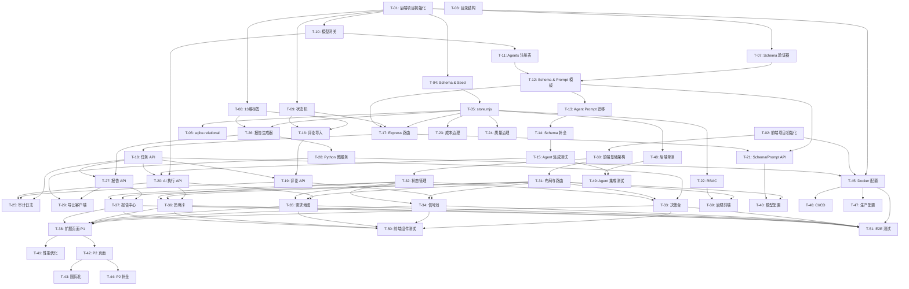

# Vocos 重构任务分解

> **版本**：v1.0
> **作者**：高见远（架构师）
> **日期**：2026-06-04
> **基于**：PRD-REFACTOR-INCREMENTAL.md + ARCHITECTURE-REFACTOR.md

---

## 任务总览

| Phase | 名称 | 任务数 | 优先级 | 预计依赖 |
|-------|------|--------|--------|---------|
| P1 | 项目脚手架 | 3 | P0 | — |
| P2 | 数据层 | 3 | P0 | P1 |
| P3 | 核心模块 | 6 | P0 | P2 |
| P4 | Agent 迁移 | 4 | P0 | P3 |
| P5 | API 层 | 5 | P0 | P4 |
| P6 | 权限治理 | 4 | P1 | P5 |
| P7 | 报告导出 | 4 | P0 | P5 |
| P8 | 前端脚手架 | 3 | P0 | P1 |
| P9 | 前端 P0 页面 | 5 | P0 | P5, P8 |
| P10 | 前端 P1 页面 | 4 | P1 | P9 |
| P11 | 前端 P2 页面 | 3 | P2 | P10 |
| P12 | Docker 部署 | 3 | P1 | P7, P9 |
| P13 | 测试 | 4 | P1 | P5, P9 |

---

## Phase 1：项目脚手架（P0）

### T-01：Node.js 后端项目初始化
- **依赖**：无
- **文件**：
  - `backend/package.json`
  - `backend/.env.example`
  - `backend/.gitignore`
- **说明**：
  - `npm init` 初始化项目
  - 安装核心依赖：express, better-sqlite3, cors, multer, uuid, dotenv
  - 配置 scripts：`dev`（nodemon）、`start`（node）、`test`（vitest）
  - 创建目录结构：src/, data/, db/, tests/
- **验收**：`npm run dev` 启动成功，Express 响应 /health

### T-02：React 前端项目初始化
- **依赖**：无
- **文件**：
  - `frontend/package.json`
  - `frontend/vite.config.ts`
  - `frontend/tsconfig.json`
  - `frontend/tailwind.config.ts`
  - `frontend/index.html`
  - `frontend/src/main.tsx`
  - `frontend/src/App.tsx`
- **说明**：
  - `npm create vite@latest` 创建 React + TypeScript 项目
  - 安装依赖：react, react-dom, react-router-dom, @mui/material, @emotion/react, @emotion/styled, tailwindcss, zustand, dexie, recharts, axios
  - 配置 Vite proxy 指向后端 localhost:3000
  - 配置 Tailwind + MUI 主题共存
- **验收**：`npm run dev` 启动成功，页面显示 "Hello Vocos"，API 代理可用

### T-03：目录结构创建与 Git 初始化
- **依赖**：T-01, T-02
- **文件**：
  - `backend/src/` 下空模块文件
  - `frontend/src/features/` 下空目录
  - `frontend/src/shared/` 下空目录
  - `.gitignore`
- **说明**：
  - 按架构设计创建完整目录结构
  - 初始化 Git 仓库
  - 编写 README.md（项目简介 + 启动说明）
- **验收**：目录结构符合架构文档，git status 显示初始文件

---

## Phase 2：数据层（P0）

### T-04：数据库 Schema 与种子数据
- **依赖**：T-01
- **文件**：
  - `backend/db/schema.sql`
  - `backend/db/seed.sql`
  - `backend/db/migrations/001_initial.sql`
- **说明**：
  - 编写完整建表语句（22 张表，含索引）
  - 编写种子数据（demo 用户、团队、项目、Agent 配置等）
  - 使用 WAL 模式，启用外键约束
- **验收**：sqlite3 执行 schema.sql + seed.sql 成功，所有表和数据完整

### T-05：store.mjs 数据层实现
- **依赖**：T-04
- **文件**：
  - `backend/src/store.mjs`
- **说明**：
  - 实现 better-sqlite3 封装：`list`, `get`, `find`, `insert`, `insertMany`, `update`, `replaceAll`
  - 实现 `listTasks`, `listAiRuns`, `getTaskAssociations` 专用查询
  - 实现 `getPipelineJob`, `savePipelineJob`, `markInterruptedPipelineJobs`
  - 实现 `createId(prefix)` + `now()` 工具函数
  - 迁移 Codex 的 `mergeWithDefaults` 和 `initializeSqliteCollections` 逻辑
- **验收**：单元测试覆盖 CRUD 操作，SQLite 文件正确生成

### T-06：sqlite-relational.mjs 关系表映射
- **依赖**：T-05
- **文件**：
  - `backend/src/sqlite-relational.mjs`
- **说明**：
  - 实现 collections.json → relational tables 映射（迁移自 Codex）
  - 22 个表的 upsert/insert/update 自动同步
  - 索引创建和诊断功能
  - 迁移版本记录（schema_migrations）
- **验收**：insert 一条 task 后，json collections 和 analysis_tasks 表数据一致

---

## Phase 3：核心模块（P0）

### T-07：JSON Schema 验证器
- **依赖**：T-01
- **文件**：
  - `backend/src/schema-validator.mjs`
- **说明**：
  - 迁移 Codex schema-validator.mjs
  - 支持 draft-07 子集：type, enum, required, properties, items, minLength, minimum, maximum, minItems
  - 实现嵌套验证（object/array 递归）
  - 返回 `{ ok, errors[] }`
- **验收**：单元测试覆盖所有 type + 嵌套场景 + 边界值

### T-08：评论标签体系（13 维）
- **依赖**：T-01
- **文件**：
  - `backend/src/comment-insights.mjs`
- **说明**：
  - 迁移 Codex comment-insights.mjs 完整代码
  - 13 维中文标签定义（key/label/description/keywords）
  - `classifyComment()` 关键词匹配分类器
  - `buildCommentInsights()` 聚合分析（信号分布/障碍/转化/内容钩子）
  - `buildAgentContext()` 构建 Agent 输入上下文
  - `listCommentSignalMatches()` 按信号筛选评论
- **验收**：输入 100 条测试评论，输出正确分类统计

### T-09：任务状态机
- **依赖**：T-01
- **文件**：
  - `backend/src/state-machine.mjs`
- **说明**：
  - 迁移 Codex state-machine.mjs
  - 10 状态枚举：draft, uploaded, mapping_required, ready, analyzing, partially_failed, failed, completed, exported, archived
  - `canTransition(from, to)` + `assertTransition(from, to)`
  - `nextStatusForParsedFile({ needsMapping })` 文件解析后状态判定
- **验收**：单元测试覆盖所有合法/非法转换

### T-10：多模型网关
- **依赖**：T-01
- **文件**：
  - `backend/src/model-adapters.mjs`
  - `backend/src/provider-keys.mjs`
  - `backend/src/model-gateway.mjs`
- **说明**：
  - `model-adapters.mjs`：迁移 Codex 代码，DeepSeek/OpenAI HTTP 调用，JSON 解析与修复，连接测试
  - `provider-keys.mjs`：迁移 Codex 代码，API Key 加密存储
  - `model-gateway.mjs`：Agent → 模型路由决策，成本策略评估，runAgent 编排，回退机制
  - 配置环境变量：DEEPSEEK_API_KEY, OPENAI_API_KEY, VOCOS_MODEL_MODE
- **验收**：
  - mock 模式：runAgent 返回 mock 结果
  - live 模式：真实调用 AI API 成功

### T-11：Agents 注册表
- **依赖**：T-10
- **文件**：
  - `backend/src/agents.mjs`
- **说明**：
  - 迁移 Codex 的 17 个 Agent 注册定义
  - 每个 Agent 含：code, name, version, inputSchemaId, outputSchemaId, defaultModel, fallbackModel, maxRetries, timeoutSeconds, costLimit
  - `getAgentByCode(code)` 查询方法
- **验收**：`getAgentByCode("comment_operation_agent")` 返回正确配置

### T-12：JSON Schema 定义与 Prompt 模板
- **依赖**：T-07, T-11
- **文件**：
  - `backend/src/schemas.mjs`
- **说明**：
  - 迁移 Codex 的 17 个 Agent 输出 Schema（agent_xxx_output_v1）
  - 迁移 Codex 的 Prompt 框架模板（agent_standard_prompt + 17 个 specialized prompts）
  - 实现 `getSchemaById()` 和 `getActivePromptForAgent()`
  - **注意**：此阶段使用 Codex 的占位 Prompt，后续 P4 Agent 迁移替换
- **验收**：所有 Schema 定义正确，Prompt 模板可正确加载

---

## Phase 4：Agent 迁移（P0）

### T-13：部署版 Agent Prompt 提取与格式化
- **依赖**：T-12
- **文件**：
  - 读取 `/opt/vocosai/services/agent_service.py`
  - 更新 `backend/src/schemas.mjs`
- **说明**：
  - 从 agent_service.py 提取 15 个 Agent 的完整 system prompt 和 user prompt template
  - 识别每个 Agent 的输入变量（占位符如 `{content_title}`, `{platform}` 等）
  - 将 Prompt 文本格式化为 `{ systemPrompt, userPromptTemplate }` 结构
  - 编写 Prompt 版本 v1.0.0（标记为"从部署版迁移"）
  - **保留原始文本不做修改**
- **验收**：对比脚本验证提取的 Prompt 与源文件逐字一致

### T-14：Agent 输入/输出 Schema 补全
- **依赖**：T-13
- **文件**：
  - `backend/src/agents.mjs`（更新）
  - `backend/src/schemas.mjs`（更新）
- **说明**：
  - 为 15 个 Agent 补充完整的输入 Schema 定义
  - 为 15 个 Agent 补充完整的输出 JSON Schema（基于 Prompt 输出要求）
  - 对齐部署版实际输出格式与 Schema 定义
  - 配置重试策略（maxRetries=2, retryDelay=1000ms）
  - 配置超时和成本限制
- **验收**：每个 Agent 都有完整的 { inputSchema, outputSchema, retry, timeout, costLimit } 配置

### T-15：Agent Prompt 集成测试
- **依赖**：T-14
- **文件**：
  - `backend/tests/agents/` 测试文件
- **说明**：
  - 对 15 个 Agent 逐条进行 mock 模式集成测试
  - 验证输入→输出 Schema 符合预期
  - 对 P0 高频 Agent（comment_operation, production_card, report_assembly）进行 live 模式测试
  - 对比部署版输出与新版输出的一致性
- **验收**：15 个 Agent 全部通过 mock 测试，P0 Agent 通过 live 测试

### T-16：评论导入服务
- **依赖**：T-08, T-09
- **文件**：
  - `backend/src/file-parser.mjs`
  - `backend/src/import-service.mjs`
- **说明**：
  - `file-parser.mjs`：文件格式检测（xlsx/csv/json），列名自动识别（20+ 字段中英文映射），数据校验
  - `import-service.mjs`：顶层导入流程编排
  - 使用 SheetJS (xlsx) 解析 Excel，csv-parse 解析 CSV
  - 支持 AI 辅助列名映射（不确定的列由 LLM 推荐）
  - 保留部署版的全部字段映射规则
- **验收**：
  - xlsx/csv/json 三种格式均可正确解析
  - 中英文列名自动识别成功率 > 90%
  - 字段映射确认后数据正确入库

---

## Phase 5：API 层（P0）

### T-17：Express 路由与中间件
- **依赖**：T-05, T-09, T-12
- **文件**：
  - `backend/src/multipart.mjs`
  - `backend/src/server.mjs`（路由注册 + 中间件）
- **说明**：
  - 迁移 Codex multipart.mjs（Multipart 表单解析）
  - 注册全部 API 路由（参考架构文档 5.1 接口总览）
  - 中间件：CORS（开发模式放行）、请求日志、错误处理、文件上传大小限制
  - 路由匹配模式对齐 Codex：`[method, regex, handler, status?]`
- **验收**：
  - `GET /health` 返回系统状态
  - `GET /api/schema` 返回枚举值和 Agent 列表
  - OPTIONS 预检请求正常

### T-18：任务管理 API
- **依赖**：T-17
- **文件**：
  - `backend/src/server.mjs`（添加 handler）
- **说明**：
  - `GET /api/tasks` — 任务列表（团队隔离）
  - `POST /api/tasks` — 创建任务（参数校验）
  - `GET /api/tasks/:id` — 任务详情（含关联计数）
  - `GET /api/tasks/:id/status` — 任务状态+流水线进度
  - `POST /api/tasks/:id/start` — 启动分析流水线（状态转换校验）
- **验收**：curl 测试所有接口，状态转换符合状态机

### T-19：评论管理 API
- **依赖**：T-16, T-18
- **文件**：
  - `backend/src/server.mjs`（添加 handler）
- **说明**：
  - `POST /api/tasks/:id/parse-comments` — 上传评论文件（multipart）
  - `POST /api/tasks/:id/confirm-mapping` — 确认字段映射
  - `GET /api/tasks/:id/comment-signals` — 评论信号池分析
  - `GET /api/tasks/:id/comment-signals/:key/comments` — 按标签筛选评论
  - 评论导出支持 csv/xlsx 格式
- **验收**：上传 xlsx → 解析成功 → 确认映射 → 评论入库 → 信号分析正确

### T-20：AI 执行 API
- **依赖**：T-10, T-15, T-18
- **文件**：
  - `backend/src/server.mjs`（添加 handler）
  - `backend/src/task-pipeline.mjs`
- **说明**：
  - `GET /api/ai/runs` — AI 执行列表（支持 taskId/status/provider 筛选）
  - `GET /api/ai/runs/:id` — AI 执行详情（含 output/preview）
  - `POST /api/ai/runs/:id/retry` — 重试 AI 执行
  - `POST /api/ai/run-agent` — 手动运行单个 Agent
  - `GET /api/ai/runs/:id/feedback` — 获取反馈
  - `POST /api/ai/runs/:id/feedback` — 提交反馈
  - `task-pipeline.mjs`：流水线执行器（顺序执行全部 Agent，状态跟踪）
- **验收**：
  - 创建任务 → 上传评论 → start pipeline → 所有 Agent 按序执行 → 状态正确
  - 单个 Agent 手动重试功能正常

### T-21：Schema/Prompt/Model 管理 API
- **依赖**：T-12, T-17
- **文件**：
  - `backend/src/server.mjs`（添加 handler）
- **说明**：
  - Schema CRUD：list/get/create/update status/validate
  - Prompt CRUD：list/get/create version/activate version
  - Model Gateway：routes/providers/key save/key delete/test
- **验收**：curl 测试所有 CRUD 操作，Schema 验证功能正常

---

## Phase 6：权限治理（P1）

### T-22：RBAC 认证模块
- **依赖**：T-05
- **文件**：
  - `backend/src/auth.mjs`
- **说明**：
  - 迁移 Codex auth.mjs 完整代码
  - 5 角色：super_admin, team_admin, member, finance_admin, ai_engineer_admin, client_viewer
  - 15 权限：task/read, task/write, report/read, report/write, ai_run/read, ai_run/write, cost/read, quality/read, model/read, model/write, prompt/read, prompt/write, schema/read, schema/write, audit/read
  - `buildRequestContext()` / `requirePermission()` / `assertTeamAccess()` / `filterByTeam()`
- **验收**：不同角色只能访问对应权限的 API

### T-23：成本治理模块
- **依赖**：T-05
- **文件**：
  - `backend/src/cost-governance.mjs`
- **说明**：
  - 迁移 Codex cost-governance.mjs 完整代码
  - `buildCostSummary()` — 按 team/project/task/period 聚合成本
  - `evaluateCostPolicy()` — 运行前成本评估（allowed/downgraded/blocked）
  - `estimateModelCost()` / `estimateTokens()` — Token 估算
  - 预算告警：80% 预警，100% 阻止
- **验收**：运行分析后，cost-summary API 返回正确统计

### T-24：质量治理模块
- **依赖**：T-05
- **文件**：
  - `backend/src/quality-governance.mjs`
- **说明**：
  - 迁移 Codex quality-governance.mjs 完整代码
  - `buildQualitySummary()` — 质量评分（Schema 合规率、模型故障率、回退率）
  - 评分公式：100 - (schema 违例 * 0.35 + 模型故障 * 0.25 + 回退 * 0.15 + 重试 * 0.15 + JSON 修复 * 0.1)
  - 人工反馈汇总：采纳率/编辑率/重生成率/拒绝率
- **验收**：AI 执行后，quality-summary API 返回合理评分

### T-25：审计日志
- **依赖**：T-05, T-18, T-19, T-20
- **文件**：
  - `backend/src/server.mjs`（添加 audit log 写入）
- **说明**：
  - 在所有写操作（task/create, task/start, comment/upload, report/generate 等）写入 audit_logs
  - `GET /api/audit-logs` — 审计日志查询（权限控制）
  - 操作审计包含：userId, role, action, resourceType, resourceId, metadata
- **验收**：创建任务后 audit_logs 表有对应记录

---

## Phase 7：报告导出（P0）

### T-26：报告生成器
- **依赖**：T-05, T-08
- **文件**：
  - `backend/src/report-generator.mjs`
  - `backend/src/xlsx-exporter.mjs`
  - `backend/src/text-utils.mjs`
- **说明**：
  - 迁移 Codex report-generator.mjs 完整代码
  - `generateTaskReport()` — 从 task/comments/aiRuns 生成报告
  - `summarizeReport()` / `detailReport()` — 报告摘要/详情
  - `exportReport()` — Markdown/HTML/XLSX 导出
  - 报告章节：执行摘要 → 任务上下文 → 内容诊断 → 评论信号池 → 用户障碍 → 平台策略 → 生产卡 → 评论运营 → 投流适配 → 证据亮点 → AI 治理附录
- **验收**：完整流程（task → report generation → markdown export）成功

### T-27：报告管理 API
- **依赖**：T-26, T-18
- **文件**：
  - `backend/src/server.mjs`（添加 handler）
- **说明**：
  - `POST /api/tasks/:id/reports` — 生成报告
  - `GET /api/tasks/:id/reports` — 报告列表
  - `GET /api/reports/:id` — 报告详情
  - `GET /api/reports/:id/download?format=markdown` — 下载报告
- **验收**：生成报告 → 列表展示 → 下载 markdown 文件成功

### T-28：Python 微服务（PDF/Word 导出）
- **依赖**：T-26
- **文件**：
  - `export-service/requirements.txt`
  - `export-service/export_server.py`
  - `export-service/Dockerfile`
- **说明**：
  - 从部署版 `export_service.py` 提取 PDF/Word 生成核心逻辑
  - 包装为 Flask 微服务，提供 `/export/pdf` 和 `/export/word` 端点
  - PDF：reportlab 生成，支持中文字体
  - Word：python-docx 生成，支持表格和图片
  - 输入：{ reportId, title, markdown, options }
  - 输出：二进制文件流
- **验收**：单独启动 Python 服务，curl POST 获取 PDF/Word 文件

### T-29：Node.js 导出客户端 + API 集成
- **依赖**：T-27, T-28
- **文件**：
  - `backend/src/export-client.mjs`
  - `backend/src/server.mjs`（更新 download handler）
- **说明**：
  - `export-client.mjs`：HTTP 客户端调用 Python 微服务
  - 更新 `GET /api/reports/:id/download` 支持 format=pdf 和 format=word
  - 添加超时和错误处理
- **验收**：生成报告 → 导出 PDF → 文件内容完整

---

## Phase 8：前端脚手架（P0）

### T-30：前端基础架构
- **依赖**：T-02
- **文件**：
  - `frontend/src/shared/types/` 全部 TypeScript 类型文件
  - `frontend/src/shared/utils/api.ts`
  - `frontend/src/shared/utils/constants.ts`
  - `frontend/src/shared/db/` Dexie.js 数据库
- **说明**：
  - 定义所有 TypeScript 接口：Task, Comment, CommentFile, AgentRun, Report, Signal, Governance
  - `api.ts`：fetch 封装（base URL, headers, error handling）
  - `constants.ts`：枚举值（platform, contentGoal, signalKeys 等）
  - Dexie.js：定义 comments/tasks/cache 表结构
- **验收**：TypeScript 编译无错误，API 调用返回正确类型

### T-31：全局布局与路由
- **依赖**：T-30
- **文件**：
  - `frontend/src/app/router.tsx`
  - `frontend/src/app/theme.ts`
  - `frontend/src/shared/components/Layout.tsx`
  - `frontend/src/shared/components/Sidebar.tsx`
  - `frontend/src/shared/components/Topbar.tsx`
  - `frontend/src/shared/components/ErrorBoundary.tsx`
- **说明**：
  - React Router 配置（/dashboard, /signals, /demands, /strategy, /reports, /settings）
  - MUI + Tailwind 主题配置（品牌色、字体、间距）
  - Layout 组件：侧边栏导航 + 顶栏 + 内容区
  - ErrorBoundary 全局错误兜底
- **验收**：页面导航正常，布局符合设计稿

### T-32：共享状态管理
- **依赖**：T-30
- **文件**：
  - `frontend/src/shared/stores/useTaskStore.ts`
  - `frontend/src/shared/stores/useSignalStore.ts`
  - `frontend/src/shared/stores/useReportStore.ts`
  - `frontend/src/shared/stores/useAgentRunStore.ts`
  - `frontend/src/shared/stores/useAuthStore.ts`
  - `frontend/src/shared/hooks/useApi.ts`
  - `frontend/src/shared/hooks/usePolling.ts`
- **说明**：
  - Zustand stores（每个模块独立 store）
  - `useApi` hook：loading/error/data 三态管理
  - `usePolling` hook：定时轮询任务状态
  - 每个 store 含 actions：fetch/create/update/delete
- **验收**：DevTools 可查看 store 状态变化

---

## Phase 9：前端 P0 页面（P0）

### T-33：决策台（Dashboard）
- **依赖**：T-31, T-32, T-18
- **文件**：
  - `frontend/src/features/dashboard/DashboardPage.tsx`
  - `frontend/src/features/dashboard/ProjectOverview.tsx`
  - `frontend/src/features/dashboard/TaskList.tsx`
  - `frontend/src/features/dashboard/CostWidget.tsx`
  - `frontend/src/features/dashboard/QualityWidget.tsx`
- **说明**：
  - 项目总览卡片（任务数、评论数、报告数）
  - 最近任务列表（状态标签、进度条）
  - 成本统计小组件（月度用量、告警）
  - 质量评分小组件
  - 创建任务入口按钮
- **验收**：页面加载显示数据，创建任务入口可用

### T-34：评论信号池（Signals）
- **依赖**：T-31, T-32, T-19
- **文件**：
  - `frontend/src/features/signals/SignalPoolPage.tsx`
  - `frontend/src/features/signals/FileUploader.tsx`
  - `frontend/src/features/signals/ColumnMapping.tsx`
  - `frontend/src/features/signals/SignalChart.tsx`
  - `frontend/src/features/signals/CommentTable.tsx`
  - `frontend/src/features/signals/SignalDetail.tsx`
  - `frontend/src/shared/hooks/useFileUpload.ts`
- **说明**：
  - 文件上传组件（拖拽 + 点击，支持 xlsx/csv/json）
  - 列名映射确认弹窗（自动识别 + 手动调整）
  - 信号分布图（Recharts 柱状图/饼图）
  - 评论表格（分页、排序、标签筛选）
  - 信号详情面板（点击标签 → 展示该标签下的评论）
- **验收**：上传文件 → 映射确认 → 信号图表渲染 → 评论筛选正常

### T-35：需求地图（Demands）
- **依赖**：T-31, T-32, T-20
- **文件**：
  - `frontend/src/features/demands/DemandsPage.tsx`
  - `frontend/src/features/demands/BarrierMap.tsx`
  - `frontend/src/features/demands/NeedClusters.tsx`
  - `frontend/src/features/demands/SentimentChart.tsx`
- **说明**：
  - 购买障碍地图（按障碍类型分组展示）
  - 需求聚类分析（用户关心的主要话题）
  - 情感深度图表（好奇/怀疑/信任/购买意愿分布）
  - 数据来源：need_barrier_agent + sentiment_depth_agent 输出
- **验收**：AI 分析完成后，需求地图正确渲染数据

### T-36：策略卡（Strategy）
- **依赖**：T-31, T-32, T-20
- **文件**：
  - `frontend/src/features/strategy/StrategyPage.tsx`
  - `frontend/src/features/strategy/StrategyCards.tsx`
  - `frontend/src/features/strategy/ProductionCard.tsx`
  - `frontend/src/features/strategy/CommentOps.tsx`
  - `frontend/src/features/strategy/PlatformStrategy.tsx`
- **说明**：
  - 策略卡片列表（平台策略 + 生产卡 + 评论运营方案 + 投流建议）
  - 生产卡详情：下一集 Brief + 脚本大纲 + 可用素材
  - 评论区运营：置顶话术 + 回复剧本 + 风控规则
  - 数据来源：platform_strategy_agent, production_card_agent, comment_operation_agent, ad_fit_agent 输出
- **验收**：策略卡正确展示 Agent 输出，内容可读

### T-37：报告中心（Reports）
- **依赖**：T-31, T-32, T-27
- **文件**：
  - `frontend/src/features/reports/ReportsPage.tsx`
  - `frontend/src/features/reports/ReportList.tsx`
  - `frontend/src/features/reports/ReportPreview.tsx`
  - `frontend/src/features/reports/ExportPanel.tsx`
  - `frontend/src/features/reports/ReportDiff.tsx`
- **说明**：
  - 报告列表（任务关联，按时间排序）
  - 报告预览（Markdown 渲染为 HTML）
  - 导出面板（Markdown / HTML / PDF / Word 格式选择）
  - ReportDiff：版本对比功能
- **验收**：生成报告 → 预览正常 → 导出 PDF/Word 下载成功

---

## Phase 10：前端 P1 页面（P1）

### T-38：扩展页面（Barriers, Competitors, ContentLab, AiCenter）
- **依赖**：T-33, T-34, T-35, T-36, T-37
- **文件**：
  - `frontend/src/features/barriers/BarriersPage.tsx`
  - `frontend/src/features/competitors/CompetitorsPage.tsx`
  - `frontend/src/features/content-lab/ContentLabPage.tsx`
  - `frontend/src/features/ai-center/AiCenterPage.tsx`
  - `frontend/src/features/ai-center/AgentRunList.tsx`
  - `frontend/src/features/ai-center/AgentRunDetail.tsx`
- **说明**：
  - 购买障碍地图页
  - 竞品机会地图页
  - 内容实验室页
  - AI 分析中心页（Agent 执行列表 + 详情 + 重试 + 反馈）
- **验收**：4 个页面可正常访问，数据来自对应 API

### T-39：权限治理前端
- **依赖**：T-31, T-22
- **文件**：
  - `frontend/src/features/settings/SettingsPage.tsx`
  - `frontend/src/features/settings/TeamManagement.tsx`
  - `frontend/src/features/governance/CostGovernance.tsx`
  - `frontend/src/features/governance/QualityGovernance.tsx`
- **说明**：
  - 设置页：团队管理、成员角色配置
  - 成本治理面板：月度用量、按模型/Agent 统计
  - 质量治理面板：成功率、Schema 合规率、反馈统计
- **验收**：治理面板数据正确展示

### T-40：模型配置前端
- **依赖**：T-31, T-21
- **文件**：
  - `frontend/src/features/settings/ModelProviders.tsx`
  - `frontend/src/features/settings/ApiKeys.tsx`
- **说明**：
  - 模型提供商管理（DeepSeek/OpenAI 配置）
  - API Key 设置（加密显示、测试连接）
  - 模型路由配置查看
- **验收**：可设置 API Key，测试连接功能正常

### T-41：前端性能优化
- **依赖**：T-33 ~ T-40
- **文件**：
  - `frontend/src/shared/hooks/useLocalCache.ts`（Dexie 缓存策略）
  - `frontend/src/shared/components/Loading.tsx`（骨架屏）
- **说明**：
  - IndexedDB 缓存策略：评论分析结果、报告列表缓存
  - 组件懒加载（React.lazy + Suspense）
  - 列表虚拟化（大数据量评论列表）
  - 骨架屏加载态
- **验收**：Lighthouse 性能评分 > 80

---

## Phase 11：前端 P2 页面（P2）

### T-42：P2 页面（Review, Brand, Benchmark）
- **依赖**：T-38
- **文件**：
  - `frontend/src/features/review/ReviewPage.tsx`
  - `frontend/src/features/brand/BrandPage.tsx`
  - `frontend/src/features/benchmark/BenchmarkPage.tsx`
- **说明**：
  - 复盘归因页
  - 品牌中心页
  - 对标中心页
- **验收**：页面可正常访问

### T-43：国际化支持
- **依赖**：T-42
- **文件**：
  - `frontend/src/shared/i18n/zh.ts`
  - `frontend/src/shared/i18n/en.ts`
  - 各组件文本改为 i18n key
- **说明**：
  - 使用 react-i18next 或自实现 i18n
  - 中英文翻译文件
  - 语言切换入口
- **验收**：切换语言后界面文本正确显示

### T-44：P2 功能补全
- **依赖**：T-42
- **文件**：
  - 各页面细节补全
- **说明**：
  - 报告模板自定义
  - 前端本地缓存优化（Dexie）
  - 用户体验细节打磨
- **验收**：所有页面功能完整

---

## Phase 12：Docker 部署（P1）

### T-45：Docker 配置
- **依赖**：T-01, T-02, T-28
- **文件**：
  - `backend/Dockerfile`
  - `export-service/Dockerfile`
  - `frontend/Dockerfile`（多阶段构建）
  - `docker-compose.yml`
  - `nginx.conf`
- **说明**：
  - 后端 Dockerfile：Node.js 18 Alpine + npm ci --production
  - 导出服务 Dockerfile：Python 3.11 + pip install -r requirements.txt
  - 前端 Dockerfile：多阶段构建（build → nginx alpine）
  - docker-compose：4 个服务（nginx, backend, export-service, 共享网络）
  - nginx.conf：反向代理配置（/api → backend, 静态资源 → dist）
- **验收**：`docker-compose up` 启动成功，前端 + 后端 + 导出服务均可访问

### T-46：CI/CD 流水线
- **依赖**：T-45
- **文件**：
  - `.github/workflows/ci.yml`
  - `.github/workflows/deploy.yml`
- **说明**：
  - CI：代码检查（ESLint + Prettier）→ 单元测试 → 构建
  - CD：Docker 镜像构建 → 推送 → 部署
- **验收**：PR 提交触发 CI，合并到 main 触发 CD

### T-47：生产环境配置
- **依赖**：T-45
- **文件**：
  - `.env.production`
  - `docker-compose.prod.yml`
  - 健康检查脚本
- **说明**：
  - 生产环境变量配置
  - 数据持久化卷配置
  - 日志收集配置
  - 健康检查端点
- **验收**：生产环境一键部署成功

---

## Phase 13：测试（P1）

### T-48：后端单元测试
- **依赖**：T-05, T-07, T-09, T-10, T-12
- **文件**：
  - `backend/tests/unit/store.test.mjs`
  - `backend/tests/unit/schema-validator.test.mjs`
  - `backend/tests/unit/state-machine.test.mjs`
  - `backend/tests/unit/comment-insights.test.mjs`
  - `backend/tests/unit/cost-governance.test.mjs`
- **说明**：
  - 使用 vitest 框架
  - store.test：CRUD + 迁移测试（含内存 SQLite）
  - schema-validator.test：所有类型 + 嵌套 + 边界
  - state-machine.test：所有状态转换路径
  - comment-insights.test：13 维标签分类准确性
  - cost-governance.test：成本计算和降级策略
- **验收**：覆盖核心模块，测试通过率 100%

### T-49：Agent 集成测试
- **依赖**：T-15, T-48
- **文件**：
  - `backend/tests/integration/agent-pipeline.test.mjs`
  - `backend/tests/fixtures/comments-sample.json`
- **说明**：
  - 使用样本评论数据
  - Mock 模式全 Agent 流水线测试
  - 验证每个 Agent 输入/输出 Schema 合规
  - 验证流水线编排正确（顺序、错误处理）
- **验收**：完整流水线在 mock 模式通过

### T-50：前端组件测试
- **依赖**：T-33 ~ T-37
- **文件**：
  - `frontend/src/**/*.test.tsx`
- **说明**：
  - 使用 vitest + @testing-library/react
  - 关键组件单元测试：FileUploader, ColumnMapping, SignalChart
  - 页面快照测试
  - Stores 状态管理测试
- **验收**：P0 页面关键组件有测试覆盖

### T-51：E2E 测试
- **依赖**：T-45, T-33 ~ T-37
- **文件**：
  - `tests/e2e/full-flow.spec.ts`
- **说明**：
  - 使用 Playwright
  - 覆盖完整流程：创建任务 → 上传评论 → AI 分析 → 查看报告 → 导出 PDF
  - Mock 模式执行
- **验收**：E2E 测试通过

---

## 任务依赖图

---

## 里程碑建议

| 节点 | 内容 | 预计包含任务 |
|------|------|-------------|
| M1：后端骨架可用 | 项目创建 + 数据层 + 核心模块 | T-01 ~ T-12 |
| M2：AI 分析可用 | Agent 迁移 + API 层 | T-13 ~ T-21 |
| M3：前端核心可用 | 前端脚手架 + P0 5 页面 | T-30 ~ T-37 |
| M4：报告导出可用 | 报告生成 + Python 微服务集成 | T-26 ~ T-29 |
| M5：治理就绪 | RBAC + 成本 + 质量 + 审计 | T-22 ~ T-25 |
| M6：Docker 就绪 | 容器化 + CI/CD | T-45 ~ T-47 |
| M7：质量达标 | 全部测试通过 | T-48 ~ T-51 |
| M8：P1 完整 | 扩展页面 + 治理前端 | T-38 ~ T-41 |
| M9：全功能完整 | P2 页面 + 国际化 + 细节 | T-42 ~ T-44 |

---

> **文档维护**：本文档由架构师高见远维护，任务变更时同步更新。
> **与团队协作**：每个 Phase 完成后通知团队 lead 审核。
