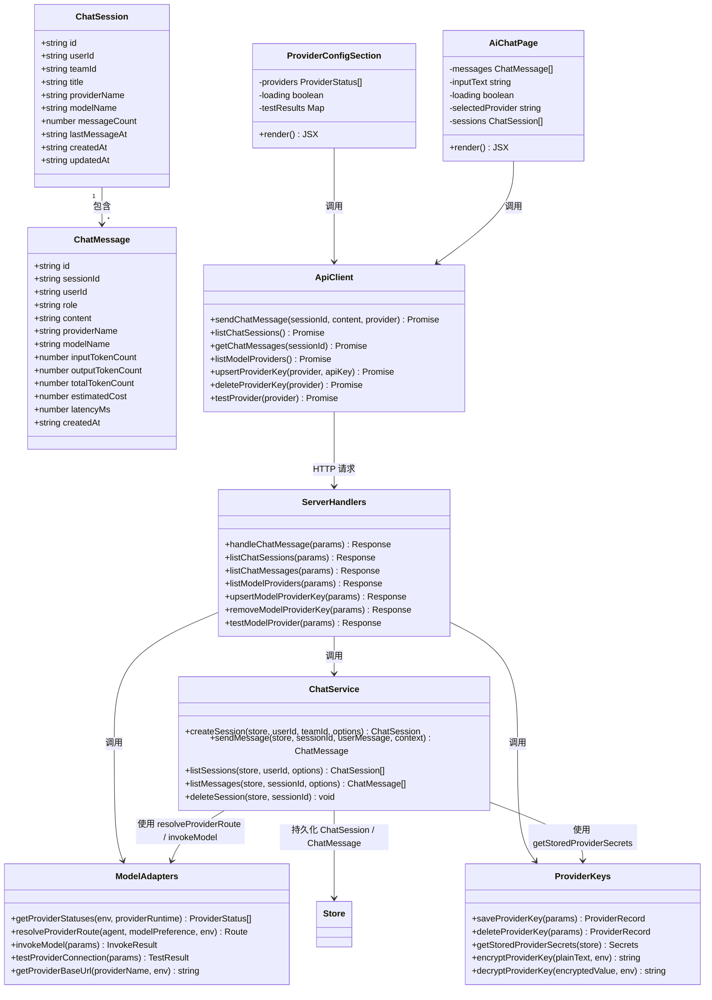
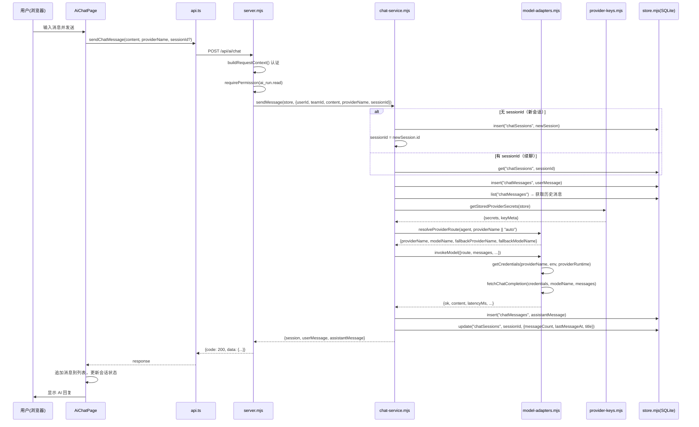
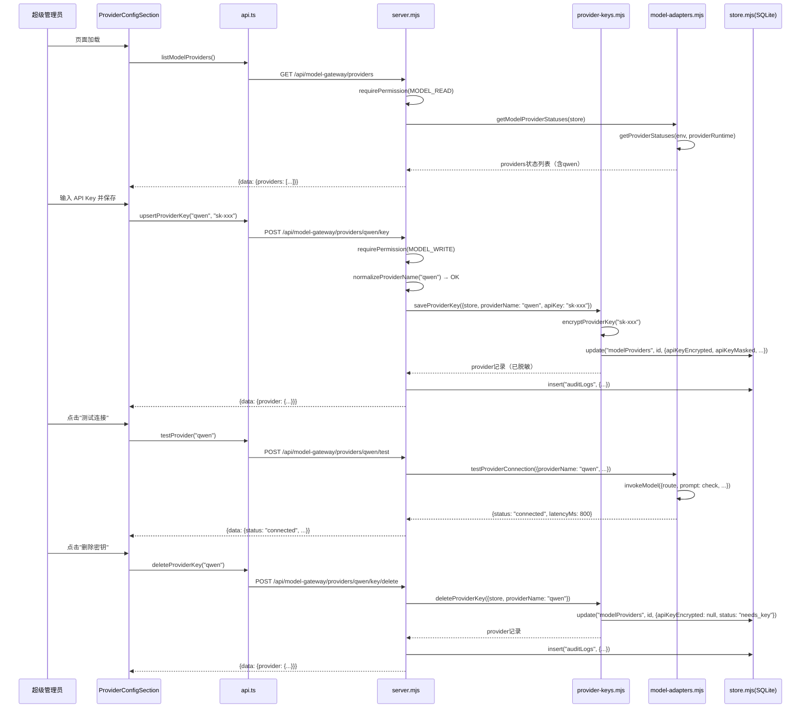
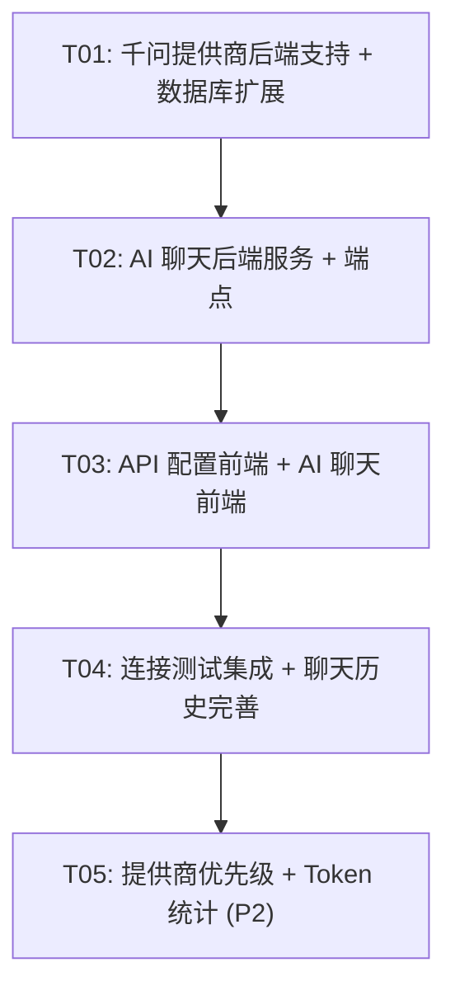

# Vocos AI 提供商管理 + 聊天代理 — 系统设计

> 架构师：高见远（Gao） | 日期：2026-07-11

---

## Part A: 系统设计

### 1. 实现方案 + 框架选型

#### 核心技术挑战

1. **千问（Qwen）提供商接入**：千问 API 兼容 OpenAI Chat Completions 格式（`/chat/completions`），base URL 为 `https://dashscope.aliyuncs.com/compatible-mode/v1`，可复用现有 `fetchChatCompletion` 函数，仅需扩展 `DEFAULTS`、`getCredentials`、`getProviderStatuses` 等函数的提供商映射。
2. **AI 聊天端点**：需要一个新的 `POST /api/ai/chat` 端点，普通用户可调用，使用系统配置的 API Key，无需用户提供自己的 Key。聊天消息需持久化到数据库，支持历史查看。
3. **权限隔离**：API 配置管理仅超级管理员可见可操作（`MODEL_WRITE`），AI 聊天对所有已认证用户开放（需新增 `CHAT_USE` 权限或复用现有权限）。
4. **聊天消息流式/非流式**：P0 阶段优先实现非流式响应（简单可靠），预留流式扩展点。

#### 框架和库选型

| 领域 | 选择 | 理由 |
|------|------|------|
| 后端路由 | 继续使用 `server.mjs` 的 `matchRoute` 自定义路由 | 不引入新框架，保持一致 |
| 数据存储 | better-sqlite3 + collections JSON 层 + 关系表同步 | 沿用现有 store 模式 |
| 前端 UI | MUI + React | 沿用现有技术栈 |
| 前端路由 | react-router-dom v6 | 已有依赖 |

**不引入任何新的第三方包**，完全基于现有技术栈实现。

#### 架构模式

延续现有的 **模块化单体** 模式：
- 后端：`server.mjs`（路由分发） + 独立功能模块 `.mjs`（业务逻辑）
- 前端：React 功能模块（`features/`） + 共享服务层（`shared/services/`）

---

### 2. 文件列表

#### 新建文件

| 文件相对路径 | 说明 |
|-------------|------|
| `backend/src/chat-service.mjs` | AI 聊天服务 — 消息持久化、提供商路由、调用模型、返回响应 |
| `frontend/src/features/ai-chat/AiChatPage.tsx` | AI 聊天页面 — 消息列表、输入框、发送/接收 |
| `frontend/src/features/admin/ProviderConfigSection.tsx` | 管理页面中的 API 配置区块组件 |

#### 需修改的文件

| 文件相对路径 | 修改内容 |
|-------------|---------|
| `backend/src/model-adapters.mjs` | 新增 `qwen` 到 `DEFAULTS`、`getProviderStatuses`、`getCredentials`、`getProviderBaseUrl`、`routeFromModelName`、`pickDefaultProviderModel`；新增 `pickQwenModel` |
| `backend/src/provider-keys.mjs` | 无需修改 — 已通过 `store.list("modelProviders")` 动态查找提供商，自动支持 qwen |
| `backend/src/server.mjs` | 1. `normalizeProviderName` 增加 `"qwen"` 白名单；2. 注册 `POST /api/ai/chat` 路由；3. 注册 `GET /api/ai/chat/sessions`、`GET /api/ai/chat/sessions/:id/messages` 路由；4. 导入 chat-service |
| `backend/src/store.mjs` | seed data 中 modelProviders 增加 qwen 记录 |
| `backend/src/sqlite-relational.mjs` | 新增 `chatMessages` collection 的关系表定义 |
| `backend/db/seed.json` | modelProviders 增加 qwen 种子数据 |
| `frontend/src/features/admin/AdminPage.tsx` | 引入 `ProviderConfigSection` 组件 |
| `frontend/src/shared/services/api.ts` | 新增 `sendChatMessage`、`listChatSessions`、`getChatMessages` 方法 |
| `frontend/src/App.tsx` | 新增"AI 聊天"菜单项和路由 |

---

### 3. 数据结构和接口

#### 3.1 类图



#### 3.2 新增数据库表

**chat_sessions 表**

| 字段 | 类型 | 约束 | 说明 |
|------|------|------|------|
| id | TEXT | PRIMARY KEY | `chat_session_{uuid}` |
| user_id | TEXT | NOT NULL | 发起聊天的用户 ID |
| team_id | TEXT | NOT NULL | 用户所属团队 ID |
| title | TEXT | | 会话标题（首条消息前 20 字） |
| provider_name | TEXT | | 使用的 AI 提供商 |
| model_name | TEXT | | 使用的模型名 |
| message_count | INTEGER | DEFAULT 0 | 消息数量 |
| last_message_at | TEXT | | 最后消息时间 |
| created_at | TEXT | NOT NULL | 创建时间 |
| updated_at | TEXT | NOT NULL | 更新时间 |

**chat_messages 表**

| 字段 | 类型 | 约束 | 说明 |
|------|------|------|------|
| id | TEXT | PRIMARY KEY | `chat_msg_{uuid}` |
| session_id | TEXT | NOT NULL | 所属会话 ID |
| user_id | TEXT | NOT NULL | 发送者用户 ID |
| role | TEXT | NOT NULL | `user` / `assistant` / `system` |
| content | TEXT | NOT NULL | 消息内容 |
| provider_name | TEXT | | 实际使用的提供商 |
| model_name | TEXT | | 实际使用的模型 |
| input_token_count | INTEGER | DEFAULT 0 | 输入 token 数 |
| output_token_count | INTEGER | DEFAULT 0 | 输出 token 数 |
| total_token_count | INTEGER | DEFAULT 0 | 总 token 数 |
| estimated_cost | REAL | DEFAULT 0 | 估算成本 |
| latency_ms | INTEGER | | 响应延迟(ms) |
| created_at | TEXT | NOT NULL | 创建时间 |

#### 3.3 API 接口定义

**POST /api/ai/chat** — 发送聊天消息

请求：
```json
{
  "content": "你好，请帮我分析一下",
  "providerName": "qwen",       // 可选，指定提供商，默认 auto
  "sessionId": "chat_session_xxx"  // 可选，续聊已有会话
}
```

响应：
```json
{
  "code": 200,
  "data": {
    "session": {
      "id": "chat_session_xxx",
      "title": "你好，请帮我分析一下",
      "providerName": "qwen",
      "modelName": "qwen-plus",
      "messageCount": 2,
      "lastMessageAt": "2026-07-11T10:00:00.000Z"
    },
    "userMessage": {
      "id": "chat_msg_xxx",
      "sessionId": "chat_session_xxx",
      "role": "user",
      "content": "你好，请帮我分析一下",
      "createdAt": "2026-07-11T10:00:00.000Z"
    },
    "assistantMessage": {
      "id": "chat_msg_yyy",
      "sessionId": "chat_session_xxx",
      "role": "assistant",
      "content": "你好！我是 Vocos AI 助手...",
      "providerName": "qwen",
      "modelName": "qwen-plus",
      "inputTokenCount": 25,
      "outputTokenCount": 150,
      "totalTokenCount": 175,
      "estimatedCost": 0.0005,
      "latencyMs": 1200,
      "createdAt": "2026-07-11T10:00:01.200Z"
    }
  }
}
```

权限：所有已认证用户（复用 `ai_run.read` 权限）

**GET /api/ai/chat/sessions** — 列出我的聊天会话

响应：
```json
{
  "code": 200,
  "data": [
    {
      "id": "chat_session_xxx",
      "title": "你好，请帮我分析一下",
      "providerName": "qwen",
      "modelName": "qwen-plus",
      "messageCount": 6,
      "lastMessageAt": "2026-07-11T10:05:00.000Z",
      "createdAt": "2026-07-11T10:00:00.000Z"
    }
  ]
}
```

权限：已认证用户，只能查看自己的会话

**GET /api/ai/chat/sessions/:id/messages** — 获取会话消息列表

响应：
```json
{
  "code": 200,
  "data": [
    {
      "id": "chat_msg_xxx",
      "sessionId": "chat_session_xxx",
      "role": "user",
      "content": "你好，请帮我分析一下",
      "createdAt": "2026-07-11T10:00:00.000Z"
    },
    {
      "id": "chat_msg_yyy",
      "sessionId": "chat_session_xxx",
      "role": "assistant",
      "content": "你好！我是 Vocos AI 助手...",
      "providerName": "qwen",
      "modelName": "qwen-plus",
      "totalTokenCount": 175,
      "latencyMs": 1200,
      "createdAt": "2026-07-11T10:00:01.200Z"
    }
  ]
}
```

权限：已认证用户，只能查看自己的会话消息

---

### 4. 程序调用流程

#### 4.1 聊天消息发送流程



#### 4.2 API 配置管理流程



---

### 5. 待明确事项

1. **聊天会话是否需要软删除**：当前设计为硬删除，若需回收站功能可后续扩展。
2. **聊天 token 限额**：是否需要对普通用户设置单日/单会话的 token 使用上限？PRD 中 P2 提到了 Token 使用量统计，但 P0 阶段不做限制。
3. **聊天上下文窗口截断策略**：当会话消息超过模型上下文窗口时，如何截断？建议取最近 N 条消息（N 由模型 context window 动态计算），丢弃最早的。P0 阶段可简单取最近 20 条。
4. **聊天系统提示词**：`system prompt` 应该硬编码还是可配置？建议 P0 阶段硬编码为"你是 Vocos AI 助手，帮助用户分析消费者声音和内容策略"，后续可在管理页面配置。
5. **`routeFromModelName` 中的 qwen 识别**：模型名包含 "qwen" 即路由到 qwen 提供商，需要确认千问的模型命名规范（如 `qwen-plus`, `qwen-max`, `qwen-turbo` 等）。
6. **聊天权限**：当前复用 `ai_run.read` 权限，member 角色也有此权限，满足"普通用户可以通过 AI 聊天功能调用"的需求。如需更细粒度控制，可新增 `chat.use` 权限。

---

## Part B: 任务分解

### 6. 依赖包列表

**无需新增任何第三方包**，完全基于现有依赖实现：
- `better-sqlite3`：已有，用于数据持久化
- `react` + `@mui/material`：已有，用于前端 UI
- `react-router-dom`：已有，用于前端路由

---

### 7. 任务列表（按依赖顺序）

#### T01: 项目基础设施 — 千问提供商后端支持 + 数据库扩展

**源文件**：
- `backend/src/model-adapters.mjs`（修改）
- `backend/db/seed.json`（修改）
- `backend/src/sqlite-relational.mjs`（修改）
- `backend/src/store.mjs`（修改 — seed data 加载增加 chatSessions/chatMessages）
- `backend/src/server.mjs`（修改 — normalizeProviderName 白名单）

**依赖**：无

**优先级**：P0

**详细描述**：
1. 在 `model-adapters.mjs` 的 `DEFAULTS` 中新增 `qwen` 提供商配置：`baseUrl: "https://dashscope.aliyuncs.com/compatible-mode/v1"`, `model: "qwen-plus"`, `reasoningModel: "qwen-max"`
2. 扩展 `getProviderStatuses()` 增加 qwen 的状态条目（含 `QWEN_API_KEY` 环境变量支持 + providerRuntime.secrets?.qwen 存储 Key 支持）
3. 扩展 `getCredentials()` 增加 qwen 分支：`apiKey: env.QWEN_API_KEY || providerRuntime.secrets?.qwen`
4. 扩展 `getProviderBaseUrl()` 增加 qwen 分支：`env.QWEN_BASE_URL || DEFAULTS.qwen.baseUrl`
5. 扩展 `routeFromModelName()` 增加 qwen 识别：模型名含 "qwen" 即路由到 qwen
6. 新增 `pickQwenModel()` 函数
7. 修改 `pickDefaultProviderModel()` 增加 qwen 分支
8. 修改 `resolveProviderRoute()` 增加 qwen 作为候选提供商
9. 在 `seed.json` 的 `modelProviders` 中增加 qwen 种子数据：`{id: "provider_qwen", providerName: "qwen", baseUrl: "https://dashscope.aliyuncs.com/compatible-mode/v1", status: "needs_key"}`
10. 在 `sqlite-relational.mjs` 的 `COLLECTION_TABLES` 中新增 `chatSessions` 和 `chatMessages` 的关系表定义
11. 在 `store.mjs` 的 `loadSeedData()` 中确保 `chatSessions` 和 `chatMessages` collection 初始化为空数组
12. 修改 `server.mjs` 的 `normalizeProviderName()` 白名单：`["deepseek", "openai"]` → `["deepseek", "openai", "qwen"]`

---

#### T02: AI 聊天后端服务 + 端点

**源文件**：
- `backend/src/chat-service.mjs`（新建）
- `backend/src/server.mjs`（修改 — 注册聊天路由 + 导入 chat-service）

**依赖**：T01

**优先级**：P0

**详细描述**：
1. 新建 `chat-service.mjs`，导出以下函数：
   - `createSession(store, {userId, teamId, providerName, modelName})` — 创建聊天会话
   - `sendMessage(store, {userId, teamId, sessionId, content, providerName})` — 发送消息并调用 AI
   - `listSessions(store, {userId, limit, offset})` — 列出用户的聊天会话
   - `listMessages(store, {sessionId, userId, limit, offset})` — 列出会话消息（校验 userId 归属）
   - `deleteSession(store, {sessionId, userId})` — 删除会话（校验 userId 归属）
2. `sendMessage` 核心逻辑：
   - 若无 sessionId，调用 `createSession` 新建会话
   - 插入 user 消息到 `chatMessages`
   - 从 DB 获取最近 20 条会话消息构建 `messages` 数组
   - 调用 `getStoredProviderSecrets(store)` 获取凭证
   - 调用 `resolveProviderRoute()` 解析路由（agent 使用 `{code: "chat_assistant", version: "1.0.0"}`）
   - 调用 `invokeModel()` 获取 AI 响应（`response_format` 不限制为 JSON，而是普通文本）
   - 插入 assistant 消息到 `chatMessages`
   - 更新 `chatSessions` 的 `messageCount`、`lastMessageAt`、`title`（首条消息时设置）
   - 返回 `{session, userMessage, assistantMessage}`
3. 在 `server.mjs` 的路由表中注册：
   - `["POST", /^\/api\/ai\/chat$/, handleChatMessage]`
   - `["GET", /^\/api\/ai\/chat\/sessions$/, listChatSessions]`
   - `["GET", /^\/api\/ai\/chat\/sessions\/([^/]+)\/messages$/, listChatMessages]`
4. 实现路由处理函数：
   - `handleChatMessage`：认证 → `requirePermission(context, PERMISSIONS.AI_RUN_READ)` → 调用 `chat-service.sendMessage`
   - `listChatSessions`：认证 → 调用 `chat-service.listSessions`
   - `listChatMessages`：认证 → 调用 `chat-service.listMessages`
5. **关键设计**：`invokeModel` 当前强制 `response_format: { type: "json_object" }`，聊天场景需要普通文本响应。新增 `chat-service.mjs` 中直接调用 `fetchChatCompletion`（从 model-adapters 导出），或者在 `invokeModel` 中增加 `responseFormat` 参数。**推荐方案**：在 `model-adapters.mjs` 中导出 `fetchChatCompletion` 函数，`chat-service.mjs` 直接使用它构建自定义请求（不强制 JSON 格式）。

---

#### T03: API 配置管理前端 UI + AI 聊天前端 UI

**源文件**：
- `frontend/src/features/admin/ProviderConfigSection.tsx`（新建）
- `frontend/src/features/admin/AdminPage.tsx`（修改）
- `frontend/src/features/ai-chat/AiChatPage.tsx`（新建）
- `frontend/src/shared/services/api.ts`（修改）
- `frontend/src/App.tsx`（修改 — 菜单 + 路由）

**依赖**：T02

**优先级**：P0

**详细描述**：
1. **api.ts 新增方法**：
   - `sendChatMessage(content: string, providerName?: string, sessionId?: string)` → `POST /api/ai/chat`
   - `listChatSessions()` → `GET /api/ai/chat/sessions`
   - `getChatMessages(sessionId: string)` → `GET /api/ai/chat/sessions/${sessionId}/messages`
2. **ProviderConfigSection.tsx**（超级管理员 API 配置区块）：
   - 调用 `api.listModelProviders()` 获取提供商列表
   - 对每个提供商显示：名称、base URL、配置状态（已配置/未配置）、密钥掩码、更新时间
   - 已配置 → 显示"删除密钥"按钮和"测试连接"按钮
   - 未配置 → 显示 API Key 输入框和"保存"按钮
   - 测试连接：调用 `api.testProvider(providerName)`，显示成功/失败 + 延迟
   - 删除密钥：调用 `api.deleteProviderKey(providerName)`，确认后删除
   - 保存密钥：调用 `api.upsertProviderKey(providerName, apiKey)`
3. **AdminPage.tsx 修改**：
   - 在现有用户管理表格下方，引入 `ProviderConfigSection` 组件
   - 仅超级管理员可见（当前 AdminPage 本身已由 `user.manage` 权限控制）
4. **AiChatPage.tsx**（AI 聊天页面）：
   - 左侧面板：会话列表（调用 `api.listChatSessions()`），支持新建会话、切换会话
   - 右侧面板：消息列表 + 输入框
   - 消息列表：用户消息右对齐，AI 回复左对齐，显示 provider/model 标签
   - 输入框：文本输入 + 发送按钮，发送后调用 `api.sendChatMessage()`
   - 可选提供商选择器（Dropdown: Auto / DeepSeek / 千问 / ChatGPT）
   - 会话切换时调用 `api.getChatMessages(sessionId)` 加载历史消息
5. **App.tsx 修改**：
   - menuItems 新增：`{text: "AI 聊天", icon: <ChatIcon />, path: "/ai-chat", permission: "ai_run.read"}`
   - Routes 新增：`<Route path="ai-chat" element={<AiChatPage />} />`

---

#### T04: 连接测试前端集成 + 聊天历史持久化完善

**源文件**：
- `frontend/src/features/admin/ProviderConfigSection.tsx`（修改 — 测试结果 UI 优化）
- `frontend/src/features/ai-chat/AiChatPage.tsx`（修改 — 历史加载优化）
- `backend/src/chat-service.mjs`（修改 — 会话标题自动生成、消息分页）
- `backend/src/server.mjs`（修改 — 删除会话端点）

**依赖**：T03

**优先级**：P1

**详细描述**：
1. ProviderConfigSection 中测试连接 UI 优化：
   - 测试中显示 loading spinner
   - 测试成功显示延迟(ms) + 绿色勾
   - 测试失败显示错误信息 + 红色叉
   - 批量测试所有已配置提供商的按钮
2. AiChatPage 聊天历史优化：
   - 会话自动标题：取用户首条消息前 20 字
   - 会话列表按 `lastMessageAt` 降序排列
   - 消息列表滚动到底部
   - 加载更多历史消息（分页）
3. chat-service 新增删除会话功能：
   - `deleteSession(store, {sessionId, userId})` — 删除会话及其所有消息
4. server.mjs 注册删除端点：
   - `["DELETE", /^\/api\/ai\/chat\/sessions\/([^/]+)$/, deleteChatSession]`

---

#### T05: 提供商优先级 + 自动切换 + Token 统计（可选，P2 延后）

**源文件**：
- `backend/src/model-adapters.mjs`（修改）
- `backend/src/chat-service.mjs`（修改）
- `frontend/src/features/ai-chat/AiChatPage.tsx`（修改）

**依赖**：T04

**优先级**：P2

**详细描述**：
1. 提供商优先级：在 `modelProviders` 表中增加 `priority` 字段，`resolveProviderRoute` 根据优先级选择
2. 自动切换：聊天时主提供商调用失败，自动 fallback 到下一个已配置的提供商
3. Token 使用量统计：新增管理页面统计视图，按用户/日/提供商聚合 token 使用量

---

### 8. 共享知识

```
- 所有 API 响应使用 {code, data, message} 格式（沿用现有 server.mjs 规范）
- 认证使用 JWT Bearer Token（Authorization header）
- 所有日期存储为 ISO 8601 UTC 字符串
- 提供商名称统一小写：deepseek, openai, qwen
- API Key 存储使用 AES-256-GCM 加密（provider-keys.mjs 已有）
- 聊天消息的 role 枚举：user, assistant, system
- ID 生成规则：chat_session_{uuid}, chat_msg_{uuid}（沿用 createId 函数）
- 数据存储双写：collections JSON 层 + 关系表（sqlite-relational.mjs 同步）
- 权限控制：MODEL_WRITE = 超级管理员专用，AI_RUN_READ = 所有已认证用户
- 千问 API 兼容 OpenAI 格式，无需单独适配器，复用 fetchChatCompletion
- 聊天场景的 AI 调用不强制 JSON 输出（response_format 不设为 json_object）
- 会话消息上下文窗口：P0 阶段取最近 20 条消息
```

---

### 9. 任务依赖图


